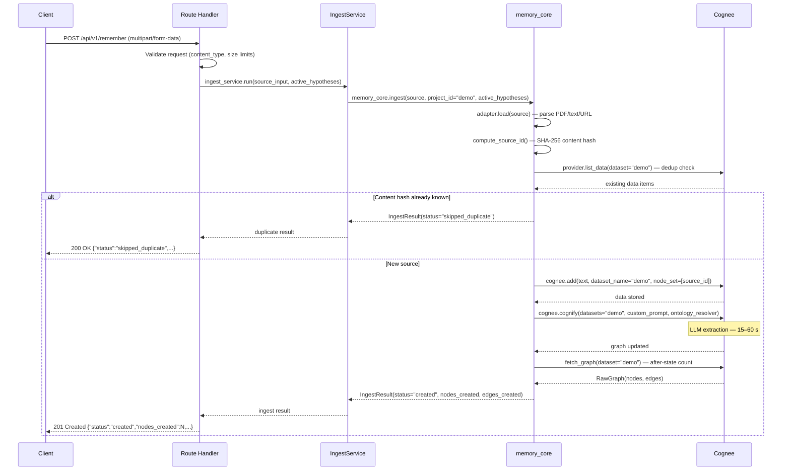
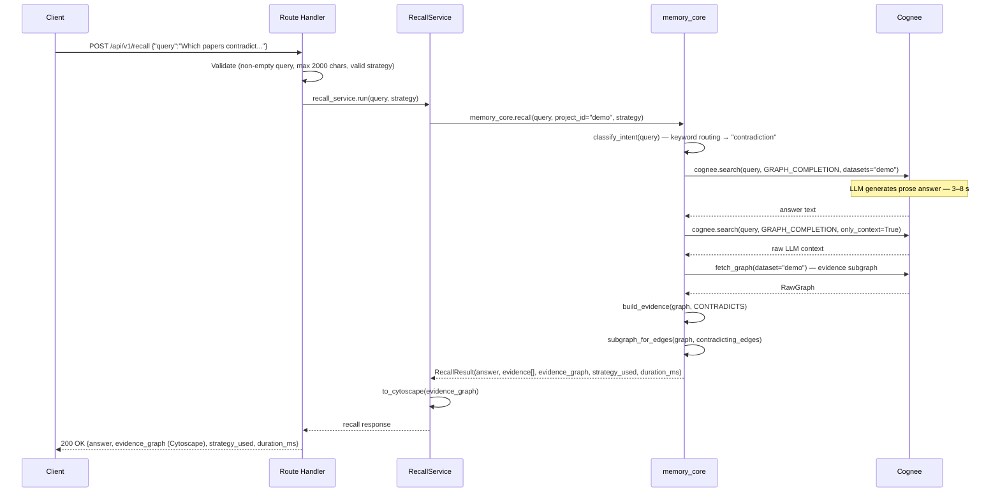
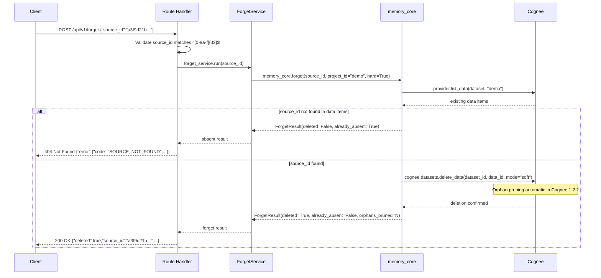

# MemoryOS — Backend API Specification

Version: 1.0
Status: **FROZEN for Milestone 3 implementation.**
Author: Engineering (pre-Milestone-3 design review).
Scope: Every endpoint the FastAPI backend will expose in the hackathon MVP.
Dependency: `memory_core/` (Milestone 2, stable — treat as a library, not editable).

> **Implementation contract**: this document is the source of truth.
> If implementation discovers a genuine gap, update this document first
> and re-obtain approval — do not silently deviate.

---

## 0. How to Read This Document

Read top-to-bottom once, then use as reference.

1. §1 — Foundational decisions every endpoint inherits.
2. §2 — Global error envelope (shared by all endpoints).
3. §3 — Exception mapping table (memory_core → HTTP).
4. §4 — Sequence diagrams for the three stateful flows.
5. §5 — Per-endpoint specifications (one section each).
6. §6 — Cytoscape.js graph format (used by `/graph` and all evidence payloads).
7. §7 — Design self-critique and decisions defended.
8. §8 — Service layer contract (for the implementer).
9. §9 — What is explicitly out of scope for Milestone 3.

---

## 1. Foundational Decisions

These apply to every endpoint and are not repeated per-endpoint.

### 1.1 Project scope: one project, hard-coded

`memory_core` requires a `project_id` on every call. The backend hard-codes
`project_id = "demo"` — a single constant defined once in backend config and
never exposed in the API surface.

**Rationale:** the hackathon MVP is a single-tenant demo. `memory_core` already
documents the single-storage-root assumption (`PROJECT_HEALTH.md` §2). Exposing
`project_id` in every request would imply multi-tenancy the library cannot
currently guarantee. This is a conscious, written-down scope reduction — not
an oversight.

**Future path:** add a path parameter (`/api/v1/projects/{project_id}/remember`,
etc.) when multi-project isolation is implemented in `memory_core`.

### 1.2 Base URL

```
/api/v1
```

All endpoints are prefixed with this base. The version token (`v1`) protects
against breaking changes without URL collision.

### 1.3 Content types

| Direction | Format |
|---|---|
| Requests (JSON payloads) | `application/json` |
| Requests (file uploads) | `multipart/form-data` |
| All responses | `application/json` |

### 1.4 Authentication

None — explicitly out of scope per `PRODUCT_PRD.md` §9 (Non-Goals).

### 1.5 CORS

The backend must emit permissive CORS headers during development
(`Access-Control-Allow-Origin: *`). The Next.js frontend and FastAPI backend
run on different ports locally.

### 1.6 Async throughout

All route handlers are `async def`. All `memory_core` public functions are
`async`. No synchronous blocking anywhere in a handler.

### 1.7 No background tasks in MVP

`ingest()` and `improve()` are slow (15–60 s). For the MVP the backend blocks
on them synchronously — the client must handle a long-lived HTTP request.
The frontend should show a loading state. Background task queuing (Celery,
FastAPI `BackgroundTasks`, etc.) is future work and explicitly out of scope.

**Rationale:** adding a queue requires polling or WebSocket for status, which
doubles the frontend complexity. For a demo with one user and a pre-ingested
corpus, the simpler path is correct.

### 1.8 No request IDs / tracing

Not implemented in MVP. Each request is stateless from the backend's perspective.

### 1.9 Timezone convention

All timestamps are **UTC ISO-8601** strings: `"2026-07-02T11:00:00Z"`.

### 1.10 Numeric precision

`duration_ms` fields are integers (milliseconds). Node/edge counts are integers.

---

## 2. Global Error Envelope

Every error response — from validation failures to provider crashes — uses the
same JSON shape. This lets the frontend handle errors uniformly.

```json
{
  "error": {
    "code": "EXTRACTION_FAILED",
    "message": "Human-readable explanation of what went wrong.",
    "detail": "Optional: raw exception message for debugging. Omitted in production."
  }
}
```

| Field | Type | Required | Notes |
|---|---|---|---|
| `error.code` | `string` | Yes | Machine-readable constant (UPPER_SNAKE_CASE). |
| `error.message` | `string` | Yes | Safe for display to the end user. |
| `error.detail` | `string \| null` | No | Raw exception string. Include in dev; suppress in prod. |

**FastAPI implementation note:** define a single `MemoryAPIError(HTTPException)`
subclass carrying `code`, `message`, and `detail`. A global exception handler
serializes it into the envelope. FastAPI's built-in `RequestValidationError`
is also caught and re-wrapped with `code = "VALIDATION_ERROR"`.

---

## 3. Exception Mapping: memory_core → HTTP

`memory_core` raises typed exceptions that cross the provider boundary. The
backend must catch every subtype at the service layer and convert it to an
HTTP response — **no raw `MemoryCoreError` or Cognee exception may reach the
wire**.

| `memory_core` exception | HTTP status | `error.code` | When raised |
|---|---|---|---|
| `ConfigurationError` | **503 Service Unavailable** | `CONFIGURATION_ERROR` | Missing/placeholder env var for Mode A, detected at provider-resolution time. The server is misconfigured, not the request. |
| `OntologyError` | **500 Internal Server Error** | `ONTOLOGY_ERROR` | OWL ontology file failed to load or validate. This is a server-side defect (the file ships with the code). |
| `ProviderError` | **502 Bad Gateway** | `PROVIDER_ERROR` | `cognee.add()` or a DB call failed after exhausting retries. External dependency fault. |
| `ExtractionError` | **502 Bad Gateway** | `EXTRACTION_FAILED` | `cognee.cognify()` raised — the graph extraction pipeline hard-faulted. External dependency fault. |
| `RecallError` | **502 Bad Gateway** | `RECALL_FAILED` | `cognee.search()` or the evidence-fetch pipeline failed. External dependency fault. |
| `CapabilityUnavailableError` | **501 Not Implemented** | `CAPABILITY_UNAVAILABLE` | An operation requires a capability the active provider lacks (e.g. `get_graph()` in Mode B without graph access). Shouldn't fire in Mode A, but must be handled defensively. |
| FastAPI `RequestValidationError` | **422 Unprocessable Entity** | `VALIDATION_ERROR` | Malformed request body or query params. FastAPI emits this automatically; the exception handler wraps it in the standard envelope. |
| Catch-all `Exception` | **500 Internal Server Error** | `INTERNAL_ERROR` | Defense in depth — anything the provider failed to type. Logged server-side; message is generic to the client. |

**Where to catch:** catch `MemoryCoreError` subclasses in the service layer (not
in route handlers). Route handlers only call service functions and rely on the
global exception handler to serialize `MemoryAPIError`. This preserves the
handlers-are-dumb contract from `ARCHITECTURE.md` §5.

---

## 4. Sequence Diagrams

### 4.1 Ingest (POST /api/v1/remember)



### 4.2 Recall (POST /api/v1/recall)



### 4.3 Forget (POST /api/v1/forget)



---

## 5. Endpoint Specifications

---

### 5.1 `POST /api/v1/remember`

#### Purpose

Ingest a new source document into the project's memory. Triggers
`memory_core.ingest()` — `cognee.add()` + `cognee.cognify()` with the
research ontology and custom prompt. Creates new nodes and edges in the
knowledge graph. Maps to Cognee's `remember()` lifecycle operation.

#### Justification

The primary write operation. Without it there is no memory to query. It is
the first step in every demo flow. Exposing it as a distinct endpoint (rather
than folding it into `/improve`) allows the frontend to clearly distinguish
"first ingest" from "knowledge expansion" — which matters for the demo narrative.

#### Request — `multipart/form-data`

`multipart/form-data` is used (not JSON) because PDF files are binary and
cannot be cleanly base64-encoded in JSON at arbitrary size. One content type
for all source types simplifies client code.

| Field | Type | Required | Validation |
|---|---|---|---|
| `content_type` | `string` | Yes | One of: `"pdf"`, `"text"`, `"markdown"`, `"url"`. Maps directly to `memory_core.models.SourceType` adapter keys. |
| `file` | `binary` | Conditional | Required when `content_type = "pdf"`. Max 20 MB. |
| `content` | `string` | Conditional | Required when `content_type ∈ {"text","markdown","url"}`. Max 500,000 characters. |
| `title` | `string` | No | Human-readable label. Stored as metadata. Max 255 chars. |
| `active_hypotheses` | `string` | No | JSON-encoded `string[]`. Active hypothesis statements passed to `memory_core.ingest()`. If omitted, no hypothesis steering. Max 5 hypotheses, each max 1,000 chars. |

**Validation rules (all checked before calling memory_core):**

1. `content_type` must be one of the four valid values → 422
2. If `content_type = "pdf"`, `file` must be present → 422
3. If `content_type ≠ "pdf"`, `content` must be present → 422
4. `file` size must not exceed 20 MB → 413 Request Entity Too Large
5. If `content_type = "url"`, `content` must begin with `http://` or `https://` → 422
6. `active_hypotheses`, if present, must be valid JSON encoding a `string[]` → 422

**SourceInput assembly (backend responsibility):**

```python
source = SourceInput(
    content=file_bytes_or_content_string,
    source_type=content_type,   # "pdf" → pdf adapter; "url" → url adapter; etc.
    title=title,
    metadata={"original_filename": filename},  # filename from upload, if any
)
```

#### Response — 201 Created

Returned when `IngestResult.status = "created"` — the graph grew.

```json
{
  "source_id": "a3f9d21b7c4e8012fc3a9087b6d5e241",
  "status": "created",
  "nodes_created": 12,
  "edges_created": 8,
  "duration_ms": 28410,
  "warnings": []
}
```

#### Response — 200 OK (duplicate)

Returned when `IngestResult.status = "skipped_duplicate"`. Same content
already exists. No graph changes occurred.

```json
{
  "source_id": "a3f9d21b7c4e8012fc3a9087b6d5e241",
  "status": "skipped_duplicate",
  "nodes_created": 0,
  "edges_created": 0,
  "duration_ms": 120,
  "warnings": []
}
```

#### Response — 200 OK (degraded)

Returned when `IngestResult.status = "degraded"`. `cognify()` completed but
produced no new nodes/edges. Source is stored; graph did not grow. May indicate
an extraction quality problem.

```json
{
  "source_id": "a3f9d21b7c4e8012fc3a9087b6d5e241",
  "status": "degraded",
  "nodes_created": 0,
  "edges_created": 0,
  "duration_ms": 19200,
  "warnings": ["cognify() completed but produced no new nodes/edges for this source"]
}
```

| Response field | Source in memory_core |
|---|---|
| `source_id` | `IngestResult.source_id` — 32-char hex SHA-256 prefix |
| `status` | `IngestResult.status` |
| `nodes_created` | `IngestResult.nodes_created` |
| `edges_created` | `IngestResult.edges_created` |
| `duration_ms` | `IngestResult.duration_ms` |
| `warnings` | `IngestResult.warnings` |

#### Status codes

| Code | Condition |
|---|---|
| 201 Created | `status = "created"` — new nodes/edges written |
| 200 OK | `status ∈ {"skipped_duplicate","degraded"}` |
| 413 Request Entity Too Large | File exceeds 20 MB |
| 422 Unprocessable Entity | Missing field, invalid content_type, bad URL format, invalid active_hypotheses JSON |
| 502 Bad Gateway | `ProviderError` or `ExtractionError` |
| 500 Internal Server Error | `OntologyError` or unexpected exception |
| 503 Service Unavailable | `ConfigurationError` |

#### Idempotency

**Effectively idempotent.** Re-submitting identical content returns
`status = "skipped_duplicate"` (200 OK) — no duplicate graph writes.
Guarantee comes from `compute_source_id()`'s content-hash dedup.

#### Latency budget

**15–60 seconds.** `cognify()` makes one or more LLM calls per document.
The HTTP client must not timeout at < 90 seconds. The frontend must show a
loading indicator.

---

### 5.2 `POST /api/v1/improve`

#### Purpose

Ingest an additional source that *expands* existing memory. Semantically
distinct from `/remember` even though the underlying call
(`memory_core.improve()` → `run_ingest()`) is identical. Maps to Cognee's
`improve()` lifecycle operation.

#### Justification

`ARCHITECTURE.md` §4 calls `improve()` "the single most under-appreciated
lifecycle operation" and "the clearest visual argument for persistent memory."
The demo's most compelling beat is: *ingest 3 papers → ask a question → add a
fourth paper → watch graph re-link → ask the same question and get a richer
answer*. A distinct `/improve` endpoint labels that beat explicitly for the
frontend, the demo script, and the judges. The alternative (one `/remember`
endpoint) works but buries the `improve()` narrative.

The cost is one additional route handler (< 20 lines). The benefit is a cleaner
mapping onto the four Cognee lifecycle operations that `HACKATHON_CONTEXT.md`
says judges will look for.

#### Request

**Identical to `POST /api/v1/remember`** — same fields, same validation rules,
same size limits.

#### Response

**Identical to `POST /api/v1/remember`** — same shape, same status codes.

#### Idempotency

Same as `/remember`: effectively idempotent via content-hash dedup.

#### Latency budget

Same as `/remember`: 15–60 seconds.

---

### 5.3 `POST /api/v1/recall`

#### Purpose

Answer a natural-language question about the project's memory using graph
traversal. Returns a prose answer, the recall strategy that was used, an
evidence subgraph in Cytoscape.js format (for UI highlighting), and timing
information. Maps to Cognee's `recall()` lifecycle operation.

#### Justification

The central user-facing capability. A question like *"Which papers contradict
our hypothesis?"* requires traversing the knowledge graph — a stateless LLM or
vanilla RAG system structurally cannot answer it. The evidence subgraph in the
response is the proof that the answer came from relationship-aware memory, not
a black-box vector lookup. Both prose and graph must travel together in one
response; this is the primary judging moment for "Best Use of Cognee."

#### Request — `application/json`

```json
{
  "query": "Which papers contradict our current hypothesis about YOLO11?",
  "strategy": null
}
```

| Field | Type | Required | Validation |
|---|---|---|---|
| `query` | `string` | Yes | Non-empty after whitespace strip. Max 2,000 characters. |
| `strategy` | `string \| null` | No | One of: `"relationship"`, `"contradiction"`, `"gap_analysis"`, `"factual"`. `null` lets `classify_intent()` choose automatically based on query keywords. |

**Validation rules:**

1. `query` must be non-empty after stripping whitespace → 422
2. `query` must not exceed 2,000 characters → 422
3. `strategy`, if non-null, must be one of the four valid values → 422

#### Response — 200 OK

```json
{
  "query": "Which papers contradict our current hypothesis about YOLO11?",
  "answer": "The RT-DETR paper (2023) contradicts the active YOLO11 hypothesis by demonstrating a 2.1 mAP improvement over YOLO on the COCO dataset...",
  "strategy_used": "contradiction",
  "evidence_graph": {
    "elements": [
      {
        "data": {
          "id": "node-uuid-paper-rtdetr",
          "label": "RT-DETR: End-to-End Object Detection with Transformers",
          "type": "Paper",
          "source_ids": ["b7c2e34a1f598a21..."],
          "attributes": {}
        },
        "classes": "entity-paper evidence-node"
      },
      {
        "data": {
          "id": "node-uuid-hyp-1",
          "label": "YOLO11 achieves best mAP on COCO",
          "type": "Hypothesis",
          "source_ids": [],
          "attributes": { "status": "active" }
        },
        "classes": "entity-hypothesis"
      },
      {
        "data": {
          "id": "edge-0",
          "source": "node-uuid-paper-rtdetr",
          "target": "node-uuid-hyp-1",
          "label": "CONTRADICTS",
          "relationship": "CONTRADICTS"
        },
        "classes": "rel-contradicts"
      }
    ],
    "node_count": 2,
    "edge_count": 1
  },
  "degraded": false,
  "duration_ms": 4230
}
```

| Response field | Source in memory_core | Notes |
|---|---|---|
| `query` | echoed from request | For client correlation |
| `answer` | `RecallResult.answer` | Prose from LLM — non-deterministic across calls |
| `strategy_used` | `RecallResult.strategy_used` | The resolved strategy (auto or explicit) |
| `evidence_graph` | Serialized `RecallResult.evidence_graph` via `to_cytoscape()` | `null` if no evidence edges found (see note below) |
| `degraded` | `RecallResult.degraded` | `true` if provider can't build a deterministic subgraph (Mode B) |
| `duration_ms` | `RecallResult.duration_ms` | Total recall pipeline time in ms |

**When `evidence_graph` is `null`:** the LLM answer is still returned. The
frontend shows the prose but does not attempt graph highlighting — there is
nothing to highlight. This is a valid response (no typed evidence edges found),
not an error.

**Note on the `evidence-node` CSS class:** nodes that appear in the evidence
subgraph should receive an additional `evidence-node` class in the Cytoscape
serializer (see §6). The frontend uses this to apply a highlight style on the
main canvas.

#### Status codes

| Code | Condition |
|---|---|
| 200 OK | Recall pipeline completed (even if `evidence_graph` is `null`) |
| 422 Unprocessable Entity | Empty query, query too long, invalid strategy value |
| 502 Bad Gateway | `RecallError` — search pipeline failed |
| 501 Not Implemented | `CapabilityUnavailableError` |
| 503 Service Unavailable | `ConfigurationError` |

#### Idempotency

**Quasi-idempotent.** Same query → same graph traversal → same deterministic
evidence subgraph. The prose answer is LLM-generated and may vary between calls.
Do not cache recall responses on the frontend.

#### Latency budget

**3–8 seconds** (two `cognee.search()` calls + one graph fetch + pure Python
traversal). Fast enough for an interactive demo. Show an "Asking memory..."
loading state.

---

### 5.4 `POST /api/v1/forget`

#### Purpose

Remove a previously-ingested source from the project's memory. Triggers
`cognee.datasets.delete_data()` with `mode="soft"` internally; orphaned
extracted entities are pruned automatically by Cognee 1.2.2. Maps to
Cognee's `forget()` lifecycle operation.

#### Justification

`forget()` is one of Cognee's four named lifecycle operations and is explicitly
named in `HACKATHON_CONTEXT.md`'s Presentation Quality criterion (the demo
should show "Selective Forgetting"). Without this endpoint the demo cannot show
the full lifecycle. It also lets the demo operator clean up test data before a
live presentation.

**Why `POST /api/v1/forget` rather than `DELETE /api/v1/sources/{source_id}`?**

The RESTful choice would be `DELETE`. The verb-based choice is used here because:

1. It matches Cognee's `forget()` naming — the demo should speak Cognee's language.
2. `source_id` is a 32-char hex string — a `DELETE /sources/a3f9d21b7c4e...`
   URL is awkward to construct and read.
3. Some HTTP clients handle `DELETE` with a body inconsistently; `POST` with
   a JSON body is unambiguous across all environments.

This is a deliberate deviation from strict REST semantics. It is documented
here so no implementer is surprised.

#### Request — `application/json`

```json
{
  "source_id": "a3f9d21b7c4e8012fc3a9087b6d5e241"
}
```

| Field | Type | Required | Validation |
|---|---|---|---|
| `source_id` | `string` | Yes | Must match `^[0-9a-f]{32}$`. |

**Why validate the format strictly?** The only valid `source_id` values are
those returned by `/remember` or `/sources`. A caller passing a UUID, a filename,
or a human-readable name should receive 422 (client bug), not a 404 (source not
found). The format is stable: `compute_source_id()` always produces a 32-char
lowercase hex SHA-256 prefix.

#### Response — 200 OK (deleted)

```json
{
  "source_id": "a3f9d21b7c4e8012fc3a9087b6d5e241",
  "deleted": true,
  "orphans_pruned": 3
}
```

#### Response — 404 Not Found (already absent)

Returned when `ForgetResult.already_absent = True`. Source does not exist in
this project's memory.

```json
{
  "error": {
    "code": "SOURCE_NOT_FOUND",
    "message": "Source 'a3f9d21b7c4e8012...' was not found in project memory.",
    "detail": null
  }
}
```

| Response field | Source in memory_core |
|---|---|
| `source_id` | echoed from request |
| `deleted` | `ForgetResult.deleted` |
| `orphans_pruned` | `ForgetResult.orphans_pruned` |

#### Status codes

| Code | Condition |
|---|---|
| 200 OK | Source found and deleted |
| 404 Not Found | `ForgetResult.already_absent = True` |
| 422 Unprocessable Entity | `source_id` fails regex validation |
| 502 Bad Gateway | `ProviderError` from delete operation |
| 503 Service Unavailable | `ConfigurationError` |

#### Idempotency

**Not idempotent.** First call returns 200 (deleted). Second call for the same
`source_id` returns 404 (already absent). Clients that need idempotency should
treat 404 on a delete attempt as a success (the goal — source removed — is
achieved either way).

#### Latency budget

**1–3 seconds** — dataset lookup + delete call, no LLM.

---

### 5.5 `GET /api/v1/sources`

#### Purpose

List all source documents currently in the project's memory. Provides data
for a "Manage Sources" panel: what has been ingested, when, and which `source_id`
to pass to `/forget`. Calls `memory_core.list_sources()`.

#### Justification

The frontend needs a source list to: (a) populate a sidebar showing what
MemoryOS remembers, (b) provide delete buttons bound to `source_id`, and (c)
communicate that uploads persist across sessions — the core demo value. Without
this endpoint the UI cannot meaningfully display the "memory is persistent"
story.

#### Request

No body. No query parameters.

#### Response — 200 OK

```json
{
  "sources": [
    {
      "source_id": "a3f9d21b7c4e8012fc3a9087b6d5e241",
      "title": "yolo11_paper",
      "source_type": "text",
      "ingested_at": "2026-07-01T09:30:00Z"
    },
    {
      "source_id": "b7c2e34a1f598a21de0a4f93c6b17082",
      "title": "rt_detr_paper",
      "source_type": "text",
      "ingested_at": "2026-07-01T09:32:00Z"
    }
  ],
  "total": 2
}
```

| Response field | Source in memory_core | Notes |
|---|---|---|
| `sources[].source_id` | `SourceRecord.node_set` | Content-hash id; use this in `/forget` |
| `sources[].title` | `SourceRecord.title` | Best-effort; may be Cognee's internal name — see known limitation below |
| `sources[].source_type` | `SourceRecord.source_type` | Currently always `"text"` — do not build UI features that depend on this being accurate |
| `sources[].ingested_at` | `SourceRecord.ingested_at` | UTC ISO-8601 |
| `total` | `len(sources)` | Convenience count |

**Known limitation** (`PROJECT_HEALTH.md` §6 item 5): Cognee 1.2.2 does not
store a recoverable user-provided title or source type. `title` falls back to
Cognee's internal document name; `source_type` is always `"text"`. Do not expose
filtering or sorting by `source_type` in the frontend.

#### Status codes

| Code | Condition |
|---|---|
| 200 OK | Always, even when `sources` is empty |
| 502 Bad Gateway | `ProviderError` |
| 503 Service Unavailable | `ConfigurationError` |

#### Idempotency

Idempotent (GET, read-only).

#### Latency budget

**< 500 ms** — no LLM, no graph read; dataset metadata only.

---

### 5.6 `GET /api/v1/graph`

#### Purpose

Return the full knowledge graph in Cytoscape.js-ready format. Powers the
main graph canvas. Calls `memory_core.get_graph()`. See §6 for the full
format specification.

#### Justification

The graph canvas is "the star" of the frontend (`ARCHITECTURE.md` §8). A judge
who sees a live, interactive knowledge graph grow as papers are ingested
understands the product's value instantly. Graph visualization is explicitly
named as "central" in `HACKATHON_CONTEXT.md` §5 (User Experience — one of
six judging dimensions). This endpoint is the backend half of that story.

#### Request

No body. No query parameters.

#### Response — 200 OK

See §6 for the complete format. Brief example:

```json
{
  "elements": [
    {
      "data": {
        "id": "node-uuid-abc",
        "label": "YOLO11: An Improved Real-Time Object Detector",
        "type": "Paper",
        "source_ids": ["a3f9d21b..."],
        "attributes": { "year": "2024" }
      },
      "classes": "entity-paper"
    },
    {
      "data": {
        "id": "edge-0",
        "source": "node-uuid-abc",
        "target": "node-uuid-hyp",
        "label": "SUPPORTS",
        "relationship": "SUPPORTS"
      },
      "classes": "rel-supports"
    }
  ],
  "node_count": 55,
  "edge_count": 170
}
```

**Scaffolding nodes:** the response includes Cognee's own internal scaffolding
nodes and edges (e.g., `BELONGS_TO_SET`, `CONTAINS`, `IS_A` edges). The backend
does **not** filter these — the frontend should de-emphasize them using the
`type = "unknown"` field as a filter signal in Cytoscape style rules.

**Empty graph:** if no sources have been ingested, returns
`{"elements": [], "node_count": 0, "edge_count": 0}` — this is a valid 200 OK,
not an error.

#### Status codes

| Code | Condition |
|---|---|
| 200 OK | Graph returned (may be empty) |
| 501 Not Implemented | `CapabilityUnavailableError` (Mode B without graph access) |
| 502 Bad Gateway | `ProviderError` |
| 503 Service Unavailable | `ConfigurationError` |

#### Idempotency

Idempotent (GET, read-only).

#### Latency budget

**< 500 ms** at validated demo scale (55–170 nodes/edges). No LLM call.
`PROJECT_HEALTH.md` §2 flags this as O(graph size) with no pagination — acceptable
at demo scale, a known risk at production scale. Do not add caching or pagination
in Milestone 3.

---

### 5.7 `GET /api/v1/stats`

#### Purpose

Return summary counts about the project's memory state. Powers the header strip
in the frontend — a quick-glance panel showing total sources, entity breakdown,
and active hypotheses. Calls `memory_core.get_stats()`.

#### Justification

Numbers that increase as papers are ingested are one of the most immediately
legible signals that memory is growing. A header strip with live counts is
cheap to implement (< 30 lines of backend code) and disproportionately valuable
for the demo's first impression. `ARCHITECTURE.md` §8 names it as part of the
frontend design.

#### Request

No body. No query parameters.

#### Response — 200 OK

```json
{
  "total_sources": 4,
  "active_hypotheses": 1,
  "entity_counts": {
    "Paper": 4,
    "Author": 6,
    "Method": 3,
    "Dataset": 2,
    "Benchmark": 1,
    "Experiment": 0,
    "Hypothesis": 1,
    "Finding": 5,
    "ResearchNote": 0,
    "Topic": 2
  },
  "last_ingest_at": "2026-07-01T09:45:00Z"
}
```

| Response field | Source in memory_core | Notes |
|---|---|---|
| `total_sources` | `MemoryStats.source_counts["total"]` | Count of ingested data items |
| `active_hypotheses` | `MemoryStats.active_hypotheses` | Graph-derived: Hypothesis nodes with `status = "active"` |
| `entity_counts` | `MemoryStats.entity_counts` | Count per EntityType. `null` if Mode B has no graph access. |
| `last_ingest_at` | `MemoryStats.last_ingest_at` | UTC ISO-8601; `null` if nothing ingested |

**When `entity_counts` is `null`:** the active provider cannot produce a
deterministic graph. Return `entity_counts: null` in the response — do not raise
an error. The frontend hides the entity breakdown section in this case.

#### Status codes

| Code | Condition |
|---|---|
| 200 OK | Always (even if all counts are zero) |
| 502 Bad Gateway | `ProviderError` |
| 503 Service Unavailable | `ConfigurationError` |

#### Idempotency

Idempotent (GET, read-only).

#### Latency budget

**< 500 ms** — involves a full graph read for entity counts (same O(graph size)
caveat as `/graph`). Acceptable at demo scale in Mode A.

---

### 5.8 `GET /api/v1/health`

#### Purpose

Liveness and readiness probe. Returns whether the backend is running and whether
`memory_core` is configured correctly. Suitable for deployment health checks
and for the frontend to detect server availability on startup.

#### Justification

Any deployed service needs a health endpoint. For a live demo it gives the
presenter a < 1 second pre-show check that everything is wired up correctly
before going on screen. Extremely cheap to implement; high operational value.

#### Request

No body. No query parameters.

#### Response — 200 OK (healthy)

```json
{
  "status": "ok",
  "memory_core_mode": "local",
  "provider": "ModeAProvider",
  "version": "1.0.0"
}
```

#### Response — 503 Service Unavailable (misconfigured)

```json
{
  "status": "degraded",
  "memory_core_mode": "local",
  "error": {
    "code": "CONFIGURATION_ERROR",
    "message": "Mode A requires LLM_PROVIDER, LLM_API_KEY, EMBEDDING_PROVIDER to be set."
  }
}
```

**Implementation:** call `memory_core.config.get_provider()` and catch
`ConfigurationError`. A successful call → 200. A caught `ConfigurationError`
→ 503. Do **not** make a live Cognee API call — health checks must be fast and
must not consume API credits.

| Response field | Source |
|---|---|
| `status` | `"ok"` or `"degraded"` |
| `memory_core_mode` | `os.environ.get("MEMORY_CORE_MODE", "local")` |
| `provider` | `type(get_provider()).__name__` (only present on 200) |
| `version` | Hard-coded string from backend config |

#### Status codes

| Code | Condition |
|---|---|
| 200 OK | `get_provider()` succeeds |
| 503 Service Unavailable | `ConfigurationError` |

#### Idempotency

Idempotent (GET, read-only).

#### Latency budget

**< 50 ms** — env var reads only, no I/O.

---

## 6. Cytoscape.js Graph Format

### 6.1 Why this format

Cytoscape.js renders a graph from an `elements` array. Each element is either
a **node** or an **edge**, distinguished by the presence of a `source` field.
The flat array format (rather than `{nodes: [], edges: []}`) is used because:
- It allows Cytoscape to resolve node references in one pass.
- It is the documented default in the Cytoscape.js API.
- It keeps the serializer to one loop rather than two.

Reference: https://js.cytoscape.org/#notation/elements-json

### 6.2 Node element

```json
{
  "data": {
    "id": "node-{node.id}",
    "label": "{node.label}",
    "type": "{node.type}",
    "source_ids": ["a3f9d21b..."],
    "attributes": { "year": "2024", "...": "..." }
  },
  "classes": "entity-{type_slug}"
}
```

| `data` field | Source | Notes |
|---|---|---|
| `id` | `"node-" + MemoryNode.id` | Prefixed to guarantee no collision with edge IDs |
| `label` | `MemoryNode.label` | Already truncated to 120 chars by `node_label()` |
| `type` | `MemoryNode.type` | `EntityType` value (`"Paper"`, `"Author"`, etc.) or `"unknown"` for scaffolding |
| `source_ids` | `MemoryNode.source_ids` | Content-hash IDs of the source documents this node came from |
| `attributes` | `MemoryNode.attributes` | Full attribute dict; available in the node inspector panel |

The `classes` string enables CSS-driven styling. Derive it by lowercasing the
entity type and replacing spaces: `"Paper"` → `"entity-paper"`,
`"ResearchNote"` → `"entity-research-note"`, `"unknown"` → `"entity-unknown"`.

**Recommended color palette (for the frontend implementer):**

| Entity Type | CSS class | Color |
|---|---|---|
| `Paper` | `entity-paper` | `#4A90D9` (steel blue) |
| `Author` | `entity-author` | `#7B68EE` (medium slate blue) |
| `Method` | `entity-method` | `#50C878` (emerald) |
| `Dataset` | `entity-dataset` | `#FFD700` (gold) |
| `Benchmark` | `entity-benchmark` | `#FF8C00` (dark orange) |
| `Hypothesis` | `entity-hypothesis` | `#FF4500` (orange-red) — make large and prominent |
| `Finding` | `entity-finding` | `#20B2AA` (light sea green) |
| `Experiment` | `entity-experiment` | `#9370DB` (medium purple) |
| `ResearchNote` | `entity-research-note` | `#87CEEB` (sky blue) |
| `Topic` | `entity-topic` | `#D3D3D3` (light grey) |
| `unknown` | `entity-unknown` | `#555555` (dark grey) — small, de-emphasized |

### 6.3 Edge element

```json
{
  "data": {
    "id": "edge-{index}",
    "source": "node-{edge.source_id}",
    "target": "node-{edge.target_id}",
    "label": "{edge.relationship}",
    "relationship": "{edge.relationship}"
  },
  "classes": "rel-{relationship_slug}"
}
```

| `data` field | Source | Notes |
|---|---|---|
| `id` | `"edge-" + sequential_index` | Edges have no natural ID in Cognee's model; index within the serialized array is sufficient |
| `source` | `"node-" + MemoryEdge.source_id` | Must match a node `id` in the same elements array |
| `target` | `"node-" + MemoryEdge.target_id` | Must match a node `id` in the same elements array |
| `label` | `MemoryEdge.relationship` | Displayed as edge label in Cytoscape |
| `relationship` | `MemoryEdge.relationship` | Redundant with `label`; kept for frontend filtering convenience |

Derive `classes` by lowercasing the relationship and replacing `_` with `-`:
`"CONTRADICTS"` → `"rel-contradicts"`, `"WRITTEN_BY"` → `"rel-written-by"`.

**Recommended edge styling:**

| Relationship | CSS class | Suggested visual |
|---|---|---|
| `CONTRADICTS` | `rel-contradicts` | Red, dashed, thick arrow — the demo-critical edge |
| `SUPPORTS` | `rel-supports` | Green, solid arrow |
| `EVALUATES` | `rel-evaluates` | Blue, solid |
| `USES` | `rel-uses` | Teal, solid |
| `WRITTEN_BY` | `rel-written-by` | Light grey, thin |
| `REFERENCES` | `rel-references` | Grey, dashed |
| `DERIVED_FROM` | `rel-derived-from` | Purple, solid |
| `ABOUT` | `rel-about` | Light grey, dotted |
| Off-vocabulary (scaffolding) | `rel-unknown` | Dark grey, hidden by default |

### 6.4 Evidence highlighting (for `/recall` responses)

When the backend serializes `RecallResult.evidence_graph` (a `MemoryGraph`
subset), it should add `"evidence-node"` to the `classes` string for every
node in the evidence subgraph:

```json
{
  "data": { "id": "node-uuid-paper-rtdetr", "label": "...", "type": "Paper", ... },
  "classes": "entity-paper evidence-node"
}
```

The frontend applies a visual highlight (e.g., glow, enlarged border) to any
element whose `classes` contains `"evidence-node"`. The frontend then checks
which full-graph node IDs match the evidence subgraph IDs and applies the
highlight on the main canvas — without re-rendering the entire graph.

### 6.5 Serializer pseudocode

This helper lives in `Backend/schemas/cytoscape.py`. It is presentation logic —
not part of `memory_core/`.

```python
from memory_core.models import MemoryGraph, EntityType, RelationshipType

def to_cytoscape(graph: MemoryGraph, evidence_node_ids: set[str] | None = None) -> dict:
    elements = []
    evidence_node_ids = evidence_node_ids or set()

    for node in graph.nodes:
        type_str = node.type.value if isinstance(node.type, EntityType) else node.type
        type_slug = type_str.lower().replace(" ", "-").replace("_", "-")
        classes = f"entity-{type_slug}"
        if node.id in evidence_node_ids:
            classes += " evidence-node"
        elements.append({
            "data": {
                "id": f"node-{node.id}",
                "label": node.label,
                "type": type_str,
                "source_ids": node.source_ids,
                "attributes": node.attributes,
            },
            "classes": classes,
        })

    for i, edge in enumerate(graph.edges):
        rel = edge.relationship.value if isinstance(edge.relationship, RelationshipType) else str(edge.relationship)
        rel_slug = rel.lower().replace("_", "-")
        elements.append({
            "data": {
                "id": f"edge-{i}",
                "source": f"node-{edge.source_id}",
                "target": f"node-{edge.target_id}",
                "label": rel,
                "relationship": rel,
            },
            "classes": f"rel-{rel_slug}",
        })

    return {
        "elements": elements,
        "node_count": len(graph.nodes),
        "edge_count": len(graph.edges),
    }
```

**Usage in recall service:**

```python
evidence_ids = {n.id for n in recall_result.evidence_graph.nodes} if recall_result.evidence_graph else set()
cyto = to_cytoscape(recall_result.evidence_graph, evidence_node_ids=evidence_ids) if recall_result.evidence_graph else None
```

---

## 7. Design Self-Critique

Before this spec is frozen, I challenged the decisions above. Below are the
questions I asked, the alternatives I considered, and why the spec landed where
it did.

---

**Q1: Should `/remember` and `/improve` be one endpoint or two?**

*Alternative:* one `POST /api/v1/ingest` endpoint. The status field already
differentiates outcomes.

*Decision: Keep two endpoints.*

`memory_core.improve()` and `memory_core.ingest()` are identical in implementation
today, but the `improve()` demo beat — "watch the graph re-link as new evidence
arrives" — is the most visually compelling moment in the whole demo. A distinct
`/improve` endpoint makes that beat explicit to the frontend, the demo script,
and the judges. Cost: one extra route handler (< 20 lines). Benefit: the full
Cognee lifecycle is visible in the API surface and in network calls during a demo.

*When to revisit:* if time pressure forces scope reduction before Milestone 4,
merge them — the backend change is < 10 lines.

---

**Q2: Should `project_id` be exposed in the API at all, even as an optional override?**

*Alternative:* accept an optional `project_id` query param, defaulting to `"demo"`.

*Decision: Keep it fully server-side.*

The `memory_core` single-storage-root limitation means multiple `project_id`
values sharing one Cognee installation are untested and explicitly unverified
(`PROJECT_HEALTH.md` §2). Exposing `project_id` implies multi-tenancy. A caller
who passes `project_id = "adversary"` gets undefined behavior. Better to hide it
entirely and be honest about scope.

*When to revisit:* when `memory_core` implements and verifies multi-project isolation.

---

**Q3: Is `POST /api/v1/forget` the right verb for a deletion, or should it be `DELETE /api/v1/sources/{source_id}`?**

Both are defensible. The REST choice (`DELETE`) is cleaner, but `forget()` is the
Cognee lifecycle name and the demo talks about "forgetting" memory — not "deleting
sources." The choice documented in §5.4 (use `POST`) is correct for this project's
demo-first framing. Any team member who disagrees should change it early, not
later — it affects demo script copy and frontend button labels.

---

**Q4: Is blocking on slow `ingest()` calls acceptable, or do we need background tasks?**

*Alternative:* return 202 Accepted immediately with a task ID; poll
`GET /tasks/{id}` for completion.

*Decision: Block synchronously in MVP.*

A background task queue requires a task model, a polling endpoint, client-side
polling logic, and frontend state management for pending tasks. That is roughly
200+ additional lines across backend and frontend. For a demo with one user and
a pre-ingested corpus, none of this complexity pays for itself. The synchronous
approach is honest about latency (the UI shows a spinner for 15–60 s) and correct.

*When to revisit:* if concurrent ingestions are needed, or if Cognee latency
exceeds HTTP client timeouts in the demo environment (set the timeout to 120 s
on the frontend as a precaution).

---

**Q5: Should `/recall` also return the flat `evidence` list (typed `Evidence` objects) alongside the Cytoscape subgraph?**

*Alternative:* return both — a `"evidence": [...]` array of structured objects
and the `"evidence_graph"` Cytoscape object.

*Decision: Return only the Cytoscape subgraph.*

The `RecallResult.evidence` list contains `MemoryNode`, `Hypothesis`, and
`RelationshipType` objects. Serializing them in addition to the Cytoscape graph
doubles the response size and creates a parallel, redundant representation of
the same data. The Cytoscape elements array already contains `type`, `label`,
and `relationship` — everything the frontend needs for a text evidence panel as
well. If the frontend later needs richer `Evidence` metadata (e.g., for a
structured citation panel), add a separate `GET /api/v1/find_evidence` endpoint
rather than bloating every recall response.

---

**Q6: Is the `source_id` format validation (`^[0-9a-f]{32}$`) too strict?**

*Alternative:* accept any non-empty string; let `memory_core` return `already_absent`.

*Decision: Validate strictly.*

The format is stable and well-defined. Strict validation catches client bugs
early with a clear error message rather than burying them in a 404. The regex
is a single line. No downside.

---

**Q7: Why not WebSocket for live graph updates?**

*Alternative:* push graph update events over WebSocket after each ingest.

*Decision: Not in MVP.*

WebSocket management on both client and server adds meaningful complexity for a
demo that has one user and one ingest at a time. The frontend polls `GET /graph`
and `GET /stats` after an ingest response returns. At demo scale this is not a
perceptible difference from push. WebSocket is the right call for a production
product; it is scope creep here.

---

**Q8: Is the 20 MB file size limit correct?**

A typical arXiv PDF is 1–5 MB. 20 MB covers the vast majority of research papers
including heavily-illustrated ones, without risking Cognee's internal chunking
limits or unpredictable `cognify()` latency. This is the right number for the
demo. Adjust upward only if a specific paper needed for the demo exceeds it.

---

## 8. Service Layer Contract

The backend must maintain a clear service layer between routes and `memory_core`.
Route handlers are dumb (parse → call service → serialize). All error-to-HTTP
mapping lives in services.

### 8.1 Recommended directory layout

```
Backend/
  app.py                  — FastAPI app creation, CORS, global exception handler
  config.py               — PROJECT_ID = "demo", FILE_SIZE_LIMIT_MB, VERSION, etc.
  routes/
    remember.py           — POST /api/v1/remember
    improve.py            — POST /api/v1/improve
    recall.py             — POST /api/v1/recall
    forget.py             — POST /api/v1/forget
    sources.py            — GET /api/v1/sources
    graph.py              — GET /api/v1/graph
    stats.py              — GET /api/v1/stats
    health.py             — GET /api/v1/health
  services/
    ingest_service.py     — wraps memory_core.ingest(); maps exceptions
    improve_service.py    — wraps memory_core.improve(); same pattern
    recall_service.py     — wraps memory_core.recall(); maps exceptions; calls to_cytoscape()
    forget_service.py     — wraps memory_core.forget(); maps exceptions; raises SOURCE_NOT_FOUND
    sources_service.py    — wraps memory_core.list_sources()
    graph_service.py      — wraps memory_core.get_graph(); calls to_cytoscape()
    stats_service.py      — wraps memory_core.get_stats()
  schemas/
    requests.py           — Pydantic request models (RememberRequest, RecallRequest, ForgetRequest)
    responses.py          — Pydantic response models (IngestResponse, RecallResponse, etc.)
    cytoscape.py          — to_cytoscape() serializer (see §6.5)
  errors.py               — MemoryAPIError class; error code constants
```

### 8.2 Exception handling pattern

Every service function follows this pattern:

```python
import memory_core
from memory_core.errors import (
    ConfigurationError, OntologyError, ProviderError,
    ExtractionError, RecallError, CapabilityUnavailableError,
)
from Backend.errors import MemoryAPIError

async def run_ingest(source_input, active_hypotheses):
    try:
        result = await memory_core.ingest(
            source_input,
            project_id=PROJECT_ID,
            active_hypotheses=active_hypotheses,
        )
    except ConfigurationError as e:
        raise MemoryAPIError(503, "CONFIGURATION_ERROR", "Server is misconfigured.", str(e)) from e
    except OntologyError as e:
        raise MemoryAPIError(500, "ONTOLOGY_ERROR", "Internal ontology error.", str(e)) from e
    except ProviderError as e:
        raise MemoryAPIError(502, "PROVIDER_ERROR", "Memory provider failed.", str(e)) from e
    except ExtractionError as e:
        raise MemoryAPIError(502, "EXTRACTION_FAILED", "Graph extraction pipeline failed.", str(e)) from e
    except Exception as e:
        raise MemoryAPIError(500, "INTERNAL_ERROR", "Unexpected error.", str(e)) from e
    return result
```

### 8.3 Global exception handler in `app.py`

```python
from fastapi import Request
from fastapi.responses import JSONResponse
from fastapi.exceptions import RequestValidationError

@app.exception_handler(MemoryAPIError)
async def memory_api_error_handler(request: Request, exc: MemoryAPIError):
    return JSONResponse(
        status_code=exc.status_code,
        content={"error": {"code": exc.code, "message": exc.message, "detail": exc.detail}},
    )

@app.exception_handler(RequestValidationError)
async def validation_error_handler(request: Request, exc: RequestValidationError):
    return JSONResponse(
        status_code=422,
        content={"error": {"code": "VALIDATION_ERROR", "message": "Request validation failed.", "detail": str(exc)}},
    )
```

---

## 9. What Is Explicitly Out of Scope for Milestone 3

Do not implement any of the following during Milestone 3. Each is a valid future
feature, none is needed for the hackathon demo.

| Feature | Why deferred |
|---|---|
| Authentication / API keys | Explicit non-goal in PRD §9 |
| Background task queue (Celery, etc.) | §7 Q4 — demo doesn't need it |
| Multi-project support (`project_id` routing) | Blocked on `memory_core` multi-project isolation |
| Pagination for `/graph` or `/sources` | Not needed at demo scale |
| WebSocket / SSE for live updates | §7 Q7 — frontend polling is sufficient |
| Streaming responses for long ingest | Client spinner is sufficient |
| Rate limiting | Single-user demo |
| Request ID / distributed tracing | Not needed for hackathon |
| `GET /api/v1/find_evidence` | Already surfaced through `/recall`'s `evidence_graph`; defer until the frontend has a specific need that `/recall` can't serve |
| `POST /api/v1/reset` | Dangerous; a CLI script calling `memory_core.reset_project()` is safer for demo prep |
| `PUT /api/v1/sources/{id}` | No update semantics in `memory_core` today |
