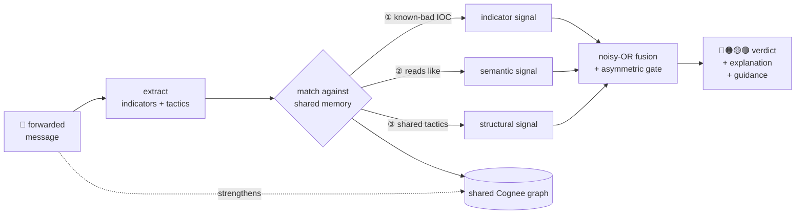
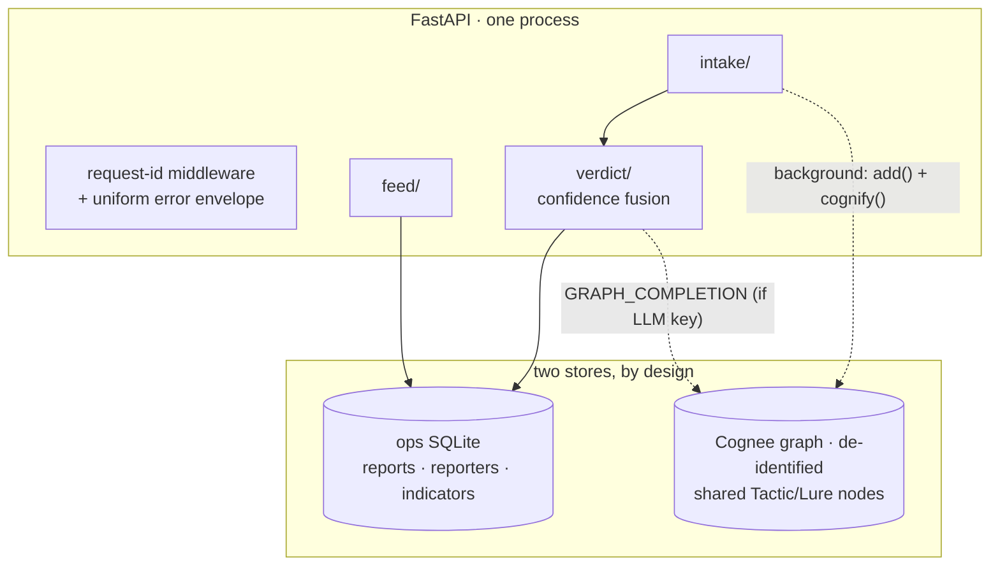

<div align="center">


# 🛡️ Antibody

**A collective immune system against scams.** Forward a text, a screenshot, or a
scam-call recording — Antibody matches it against a shared memory graph of known scam
campaigns and hands back a **verdict**, a **cited explanation**, and **what to do next**.
Every report, confirmed or false-positive, makes the graph a little smarter for the next
person.

**Multi-modal by design** — Antibody takes **text**, **images** (SMS/email screenshots),
and **voice** (scam-call recordings), and is built on **[Cognee](https://github.com/topoteretes/cognee)**
as its shared memory graph.

<p>
  <a href="https://antibody-251148844884.asia-south1.run.app"></a>
  <a href="https://github.com/aniket-3001/Antibody/actions/workflows/ci.yml"></a>
  
  <a href="LICENSE"></a>
</p>

<p>
  
  
  
  
  
</p>

[**Live demo**](https://antibody-251148844884.asia-south1.run.app) ·
[Quick start](#quick-start) ·
[How it works](#how-it-works) ·
[Architecture](#architecture) ·
[Docs](docs/) ·
[AI disclosure](#ai-assistance-disclosure)

<sub>🤖 Built with AI assistance (Claude / Claude Code) — see the [full disclosure](#ai-assistance-disclosure).</sub>

</div>

---

## The problem

Scams are a memory problem. The same campaign hits thousands of people with tiny
variations — a "USPS redelivery fee" today, a reworded "unpaid toll" tomorrow, the same
fake-fee tactic underneath. Each victim meets it cold, decides alone in ten seconds, and
whatever they learn dies with them. The scammer, meanwhile, reuses the same playbook
across families and channels.

Antibody turns that around: it gives a whole community **one shared memory**. When you
forward a suspicious message, you're not just asking "is this a scam?" — you're checking
it against everything everyone else has already seen, and teaching the graph for the next
person. The verdict is honest about its confidence, explains itself with cited evidence,
and — critically — **never hard-accuses a legitimate message**, because a false alarm on a
real bank alert is worse than a cautious maybe on a scam.

## How it works



1. **Intake** (`api/intake/`) — text, SMS screenshots, or scam-call audio arrive via
   `POST /report` / `POST /report/upload`. Loaders OCR/transcribe raw files; a
   deterministic pass pulls out indicators (URLs, phones, wallets) and candidate tactics.
2. **Memory** (`api/memory/`) — the only layer that talks to Cognee. Reports are
   cognified into a shared graph where `Tactic` and `Lure` nodes are **shared across
   families**, so the graph can answer *"this campaign uses the same fake-fee tactic as
   that one."*
3. **Verdict** (`api/verdict/`) — a transparent [confidence engine](docs/confidence-engine.md)
   fuses five signals into one of four bands.
4. **Feed** (`api/feed/`) — `GET /feed`, `/families`, `/graph` surface trending families
   and the shared-tactic graph for the live threat feed.

### The four verdict bands

| Band | | Trigger |
|---|---|---|
| **Confirmed** | 🔴 | Exact match on a known-bad indicator (URL / phone / wallet) |
| **Likely** | 🟠 | Strong semantic/structural match + corroborating reports |
| **Suspicious** | 🟡 | Weak / semantic-only match |
| **Unrecognized** | 🟢 | No meaningful match — safety tips only |

> **The gate is asymmetric by design.** Only a *hard* signal can reach 🔴 Confirmed —
> semantic resemblance alone is capped at 🟠 Likely, so a legitimate message can never be
> hard-accused. This is the product's core safety property, and it has a
> [dedicated regression test](tests/unit/test_confidence.py). See
> [the confidence engine](docs/confidence-engine.md#the-asymmetric-safety-gate).

## Memory that gets smarter (Cognee)

Antibody is built around [Cognee](https://github.com/topoteretes/cognee) as the memory
layer — it's the **system of record**, not a logo. The whole product maps onto four Cognee
verbs:

- **remember** — `add()` + `cognify()` fold each report into the shared graph.
- **recall** — `search(GRAPH_COMPLETION)` finds cited matches for the explanation.
- **improve** — `memify()` reinforces a family after a confirmed outcome and decays stale ones.
- **forget** — scoped `forget()` prunes a false positive back out.

Details: [memory layer](docs/memory-layer.md).

## Architecture

One FastAPI process serves the API **and** the built React frontend. A report takes a
**fast path** (verdict now, from deterministic + semantic memory) and a **slow path**
(strengthen the Cognee graph in the background), so the user never waits on the graph.



The **ops SQLite** store holds operational rows and reporter trust (PII stays here); the
**Cognee graph** holds de-identified scam knowledge. This split is why a privacy erasure is
a cheap DB delete, never graph surgery. Full walkthrough: [architecture](docs/architecture.md).

## Documentation

Antibody ships a full [`docs/`](docs/) folder:

| Doc | |
|---|---|
| [Architecture](docs/architecture.md) | Request lifecycle, the two-store design, package layout |
| [Confidence engine](docs/confidence-engine.md) | Five signals, noisy-OR fusion, the asymmetric safety gate |
| [Memory layer](docs/memory-layer.md) | The four Cognee verbs, the shared-node ontology, degradation |
| [Data model](docs/data-model.md) | Ops schema (ER diagram), graph ontology, semantic index |
| [API reference](docs/api-reference.md) | Every endpoint + the error envelope, with `curl` |
| [Security & privacy](docs/security-and-privacy.md) | De-identified graph, anti-poisoning, the safety gate |
| [Deployment](docs/deployment.md) | Docker, Cloud Run gotchas, env vars, secrets |
| [Contributing](docs/contributing.md) | Dev setup, the quality gate, adding a scam family |

## Tech stack

| Layer | Technology |
|---|---|
| Memory | **Cognee 1.2.2** (graph + vector), embedded Kuzu + LanceDB, local `fastembed` embeddings |
| Backend | Python 3.11, FastAPI, pydantic-settings, SQLite (ops store) |
| Verdict | Pure noisy-OR confidence fusion with an asymmetric safety gate |
| Intake | pytesseract (OCR), faster-whisper (audio), PyMuPDF (PDF) — all optional, graceful |
| Frontend | React 18, Vite, Tailwind CSS v4, framer-motion |
| Extension | Chrome/Edge MV3 browser extension — check text or a page via the read-only `/scan` |
| Quality | ruff · mypy · pytest (67 tests, ~75% coverage) · pre-commit · GitHub Actions CI |
| Deploy | Single Docker image · Google Cloud Run (gen2) · Render |

## Quick start

Requires **Python 3.11+** and **Node 18+**.

```bash
# Backend
cp .env.example .env                 # all keys optional
pip install -r api/requirements.txt
uvicorn api.main:app --host 127.0.0.1 --port 8000 --reload

# Frontend (separate terminal)
cd frontend
npm install
npm run dev    # http://localhost:5173, proxies API paths to :8000
```

The backend seeds its own graph on first boot (synthetic reports across six scam families
plus legit controls) — there's no empty-state demo, and **no LLM key is required**. Set
`LLM_*` in `.env` to additionally light up Cognee's cited graph explanations and the
improve/forget loop. See [deployment](docs/deployment.md) for the full env table and
provider examples.

## Testing

```bash
pip install -r requirements-dev.txt
ruff check .        # lint
mypy                # types
pytest              # 67 tests, no API keys needed
pytest --cov        # with coverage
```

The suite covers indicator/tactic extraction, the **asymmetric gate** (semantic-only
evidence can never reach `confirmed` — the core safety property), semantic matching, the
ops store, multimodal loaders, the error-envelope contract, and an end-to-end API smoke
test. It runs with no LLM key, exactly as CI does.

## Project structure

```text
api/
  main.py            # app boot, lifespan, CORS, request-id middleware, static mount
  config.py          # typed env settings + Cognee env export
  core/              # cross-cutting: logging (correlation ids), typed errors, handlers
  intake/            # POST /report, /report/upload — loaders + write path
  memory/            # indicators · semantic · confidence · store · memory_service · ontology
  verdict/           # engine.py — signals → fusion → band → guidance
  feed/              # live threat feed + shared-tactic graph
seed/                # synthetic scam families, reports, and legit controls
frontend/            # React + Vite (CheckView, FeedView, GraphView, ...)
extension/           # Chrome/Edge MV3 extension — read-only /scan from the browser
docs/                # full project documentation (see above)
tests/               # unit + API smoke + error-envelope contract
```

## Deployment

Antibody ships as a **single Docker container** — `uvicorn api.main:app` serves both the
API and the built frontend from one process.

```bash
docker build -t antibody .
docker run -p 8000:8000 --env-file .env antibody   # http://localhost:8000
```

The live demo runs on Google Cloud Run. Two flags matter more than they look —
`--execution-environment gen2` (async HTTP breaks on gen1's gVisor sandbox) and
`--no-cpu-throttling` (background `cognify()` needs CPU after the response). Full guide:
[deployment](docs/deployment.md).

## AI assistance disclosure

**This project was built with AI assistance.** We used Anthropic's Claude
(via Claude Code) throughout development — for architecture drafting, code generation
across the backend and frontend, documentation, test writing, and iterative debugging.

We disclose this openly, per the hackathon's requirement and in the spirit of honest
engineering. The **design decisions were directed by the human author**: the shared-node
Cognee ontology, the four-band confidence gate and its asymmetric safety property, and
the reuse of Cognee's `add` / `cognify` / `search` / `improve` / `forget` verbs. AI was
the pair programmer; the product direction, review, and final judgment were human.

## License

[MIT](LICENSE)
