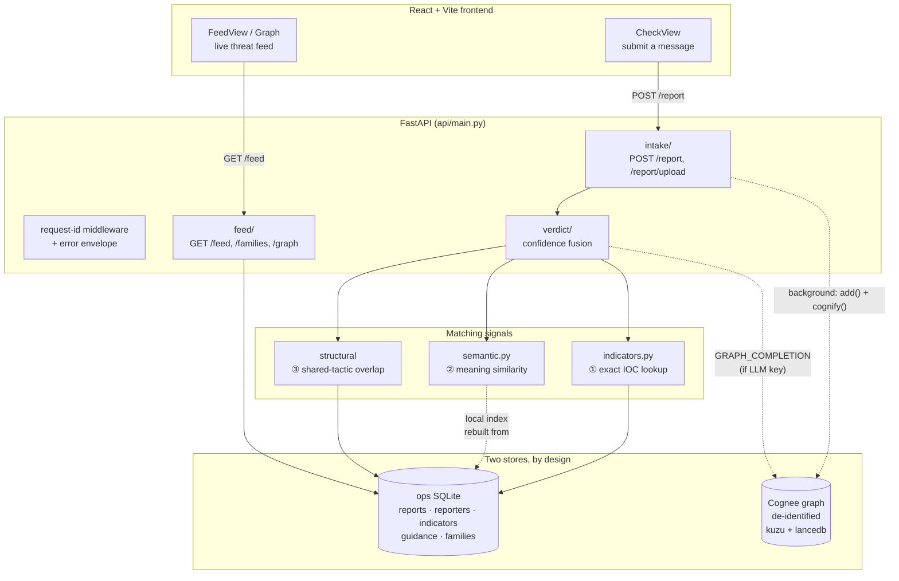
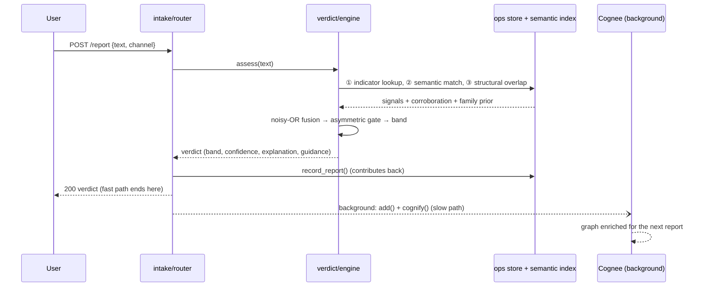

# Architecture

Antibody is a single FastAPI service that serves both the JSON API and the built
React frontend from one process. Its job is to turn a forwarded scam message into
a **verdict + explanation + guidance** in one fast request, while strengthening a
shared memory graph in the background so the next person gets a sharper answer.

## The system at a glance



## Two stores, on purpose

Antibody deliberately keeps **two** stores, because they answer to different masters:

- **Ops SQLite (`api/memory/store.py`)** — the operational, PII-adjacent rows:
  the report log, reporter trust scores, the known-bad indicator lookup, and
  per-family guidance. These power the deterministic signals and the live feed.
  Deleting a reporter here is a normal `DELETE` — never graph surgery.
- **Cognee graph (`api/memory/memory_service.py`)** — the durable, **de-identified**
  scam knowledge: families, and the `Tactic`/`Lure` nodes shared across them. This
  is what lets Antibody answer *"this new campaign uses the same fake-fee tactic as
  the tech-support scam"* — a fact a flat table cannot represent.

Reporter PII never enters the graph (see [Security & privacy](security-and-privacy.md)).
This split is why a GDPR erasure is a cheap SQLite delete instead of a risky
graph rewrite.

## The request lifecycle

A `POST /report` is intentionally split into a **fast path** (returns a verdict now)
and a **slow path** (strengthens the graph after responding):



The fast path never blocks on Cognee. If Cognee is unavailable — no LLM key, still
loading models, or a network blip — `MemoryUnavailable` is raised and swallowed,
and the deterministic + semantic layer produces a correct verdict on its own. See
[Memory layer](memory-layer.md) for the degradation contract.

## Package layout

```text
api/
  main.py            # app boot, lifespan, CORS, request-id middleware, static mount
  config.py          # typed env settings (pydantic-settings) + Cognee env export
  core/              # cross-cutting: logging (correlation ids), typed exceptions,
                     #   centralized error handlers → one JSON envelope
  intake/            # POST /report, /report/upload — loaders + write path (ingest.py)
  memory/            # the matching + storage layer:
                     #   indicators.py  ① IOC extraction + tactic/lure tagging
                     #   semantic.py    ② dependency-free cosine index (+ fallback)
                     #   confidence.py  noisy-OR fusion + asymmetric gate (pure)
                     #   store.py       ops SQLite (the only sync-DB module)
                     #   memory_service.py  the ONLY module that imports cognee
                     #   ontology.py    the shared-node Cognee graph_model
  verdict/           # engine.py — orchestrates signals → fusion → band → guidance
  feed/              # router.py — live threat feed + shared-tactic graph
seed/                # synthetic scam families, reports, and legit controls
frontend/            # React + Vite (CheckView, FeedView, GraphView, ...)
tests/               # unit (indicators, semantic, store, confidence, loaders) +
                     #   API smoke + error-envelope contract
```

## Key design decisions

- **Cognee is the star, not a crutch.** The confidence engine works fully without
  it; Cognee makes the explanations *cited* and the memory *self-improving*. Taking
  Cognee out degrades the product (no cross-family traversal, no cited evidence) but
  never breaks it.
- **The fast path is pure and deterministic.** `confidence.py` has no I/O — it's
  fused math over five floats, which is why the [safety property](confidence-engine.md#the-asymmetric-safety-gate)
  is unit-testable in isolation.
- **One place touches Cognee.** `memory_service.py` is the entire blast radius of a
  Cognee version bump. Every method degrades gracefully.
- **One error shape.** `api/core` stamps every request with a correlation id and
  renders every failure as `{error, message, request_id, path}` — see
  [API reference](api-reference.md#error-envelope).
