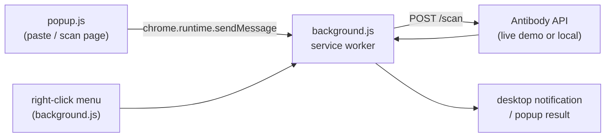

# Browser extension

A Chrome/Edge MV3 extension (`extension/`) that checks selected or pasted text against
Antibody's shared scam-pattern graph without leaving the page. It is **read-only** —
every request goes to `POST /scan`, never `/report`, so a quick check never touches or
grows the shared memory graph.

## Install it

1. Open `chrome://extensions` (or `edge://extensions`).
2. Toggle **Developer mode** on (top-right).
3. Click **Load unpacked** and select the repo's `extension/` folder.
4. Pin the Antibody icon to the toolbar (optional, but makes the popup one click away).

A packaged build for store submission is at `antibody-extension-v1.0.0.zip`; loading
`extension/` unpacked is the normal path for local use and development.

## Use it

There are three ways to check text, all backed by the same `/scan` call:

- **Right-click a selection** — highlight any text on a page → *"Check '…' with
  Antibody"* → a desktop notification pops up with the verdict band and a one-line
  explanation. No popup window needed.
- **Popup — paste text** — click the toolbar icon, paste or type text into the box,
  click **Check it**.
- **Popup — scan the page** — click **Scan this page** to grab the current tab's
  visible text (first 4000 characters) and check it in one step. This reads
  `document.body.innerText` via `chrome.scripting`, so it can't run on browser-internal
  pages (`chrome://`, the Web Store, etc.) — that's a Chrome restriction, not a bug.
- **Open full app** — a link in the popup opens the full web app in a new tab for the
  richer verdict view, Feed, and Knowledge graph.

## What it sends and doesn't

- Only the selected/pasted/scanned **text**, in a single `POST /scan {text}` call.
- Nothing is stored: `/scan` is a read-only verdict lookup, distinct from `/report`
  (which is what actually feeds the shared graph). Right-click or popup checks never
  create a report, never appear in Feed or My Reports, and never affect anyone's
  leaderboard trust score.

## Architecture

Requests are made from the **background service worker**, not a content script or the
popup directly — `manifest.json`'s `host_permissions` grant the service worker
cross-origin access to the API, which a page-injected content script would not get
(page CORS still applies there). Popup and right-click both relay through one
`scanText()` in `background.js` so there's a single fetch/error path.

## Pointing it at a different backend

By default the extension talks to the **live Cloud Run demo**
(`https://antibody-251148844884.asia-south1.run.app`) — it works the moment it's
loaded, no local server required. To point it at a local backend instead:

1. Run the backend locally: `uvicorn api.main:app --host 127.0.0.1 --port 8000`.
2. Edit `API_BASE` in `extension/background.js` to `http://127.0.0.1:8000`
   (`http://127.0.0.1:8000` and `http://localhost:8000` are already allowlisted in
   `manifest.json`'s `host_permissions`, so no manifest edit is needed).
3. Reload the extension from `chrome://extensions` (the refresh icon on its card).

## Permissions

| Permission | Why |
|---|---|
| `activeTab` / `scripting` | Read the current tab's visible text for "Scan this page" |
| `contextMenus` | Add the right-click "Check with Antibody" entry |
| `notifications` | Show the verdict as a desktop notification after a right-click check |
| `host_permissions` | Cross-origin `fetch` to the API from the background worker, bypassing page CORS |

See `extension/privacy_policy.html` for the store-facing privacy policy — it mirrors
the same "nothing is stored, /scan is read-only" guarantee described above.
