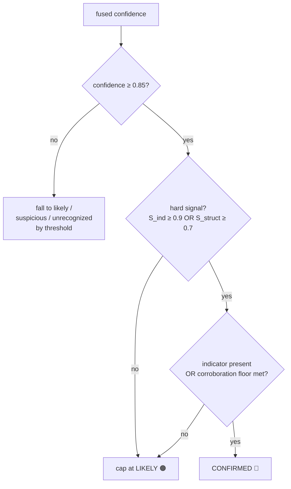

# The confidence engine

This is the heart of Antibody and the piece worth understanding first. It takes a
message, scores it against memory along five independent axes, fuses those scores
into a single confidence, and maps that to one of four verdict bands — with a hard
safety guarantee baked in.

Source: [`api/memory/confidence.py`](../api/memory/confidence.py) (pure, no I/O) and
[`api/verdict/engine.py`](../api/verdict/engine.py) (orchestration).

## The five signals

Every report is scored on five axes, each a strength in `[0, 1]`:

| Signal | Symbol | What it measures | Source |
|---|---|---|---|
| **Indicator** | `S_ind` | Exact match on a known-bad IOC (URL domain, phone, wallet, sender, gift-card ask) | Deterministic lookup in the ops store |
| **Semantic** | `S_sem` | How closely the message *reads* like a prior report, by meaning | Local cosine index / Cognee vectors |
| **Structural** | `S_struct` | Fraction of a family's signature tactics/lures this message reuses | Shared-tactic overlap |
| **Corroboration** | `S_corr` | How many trust-weighted, distinct people independently reported this family | Ops store |
| **Family prior** | `S_fam` | The family's prevalence, decayed by how long since it was last seen | Ops store |

The first three are *primary* signals that tie a message to a family. The last two
are *corroborating* — they can raise confidence but, on their own, can never
manufacture a match (see [the family-inheritance guard](#the-family-inheritance-guard)).

## Noisy-OR fusion

The five signals are fused with a **weighted noisy-OR**, not an average:

$$\text{confidence} = 1 - \prod_{i} \left(1 - w_i \cdot S_i\right)$$

with per-signal weights:

| Signal | Weight `w_i` |
|---|---|
| indicator | 0.98 |
| semantic | 0.75 |
| structural | 0.72 |
| corroboration | 0.70 |
| family | 0.55 |

**Why noisy-OR and not a weighted average?** An average *dilutes* one decisive
signal among weak ones — a known-bad crypto wallet (near-certainty) would get
watered down by four zeros. Noisy-OR treats the signals as independent evidence,
so it captures two behaviours at once:

- **One strong signal is enough.** A known-bad URL alone drives confidence high.
- **Many weak signals corroborate.** Semantic + structural + several independent
  reporters also reach high confidence, even with no single smoking gun.

And it stays explainable: *"94% because the domain is known-bad **and** 5 people
reported it"* is a literal reading of the formula.

## The four bands

Fused confidence maps to a band by threshold (defaults from `config.py`, overridable):

| Band | Emoji | Threshold | Meaning |
|---|---|---|---|
| **Confirmed** | 🔴 | `≥ 0.85` **and** the gate | A known-bad match — do not engage |
| **Likely** | 🟠 | `≥ 0.60` | Strong match; treat as a scam |
| **Suspicious** | 🟡 | `≥ 0.35` | Weak / semantic-only; be cautious |
| **Unrecognized** | 🟢 | `< 0.35` | No meaningful match — safety tips only |

## The asymmetric safety gate

This is the single most important property in the codebase, and it has a dedicated
test that must never regress ([`test_confidence.py`](../tests/unit/test_confidence.py)).

> **A message can only be hard-accused (`confirmed`) on a *hard* signal — an exact
> known-bad indicator or a strong structural match. Semantic resemblance alone can
> never reach `confirmed`.**

Concretely, `confirmed` requires **all** of:

1. fused confidence `≥ 0.85`, **and**
2. a *hard* signal: `S_ind ≥ 0.9` **or** `S_struct ≥ 0.7`, **and**
3. a corroboration floor when there's no indicator: a single low-trust report can't
   push a structural-only match to `confirmed` (needs ~3 trust-weighted reporters).

If confidence clears `0.85` but there's no hard signal, the verdict is **capped at
`likely`** — never `confirmed`.

**Why asymmetric?** A false "Confirmed scam" on a legitimate bank fraud-alert text is
a worse failure than a cautious "Suspicious" on a real scam. The gate makes that
trade-off structural: when Antibody is unsure, it *cautions and educates* rather than
*accuses*. A real bank/shipping message — which resembles scams by meaning — is
recognized as legit through the control set (see [semantic matching](#legit-controls-the-other-half-of-the-gate)),
never hard-accused.



## The family-inheritance guard

A subtle trap: corroboration and the family prior are keyed by *family*. If a message
merely *smells* like the "toll scam" family, it must not silently inherit that
family's 50 prior reports and get pushed to `confirmed` on borrowed corroboration.

So the engine only lets a report inherit a family (and that family's corroboration /
prior) when **this** report has a real primary signal tying it there:

```python
primary_match = (s_ind >= 0.9) or (s_sem > 0) or (s_struct >= 0.4)
if family and not primary_match:
    family = None      # drop the borrowed family
    s_struct = 0.0
```

Without this, corroboration alone could manufacture a false positive.

## Corroboration and recency, precisely

- **Corroboration** grows with trust-weighted distinct reporters but saturates below
  1.0, so a sockpuppet flood can't run it to certainty:
  $$S_\text{corr} = 1 - e^{-k \cdot \text{trust\_weighted\_reporters}}$$
- **Family prior** is prevalence × recency, so a dormant campaign can't fire at full
  strength on a lookalike:
  $$S_\text{fam} = \left(1 - e^{-0.15 \cdot \text{count}}\right) \times \max(0.15,\ 0.5^{\,\text{days\_since\_last}/30})$$
  (a ~30-day half-life, fed by Cognee's `memify` decay).

## Legit controls: the other half of the gate

The [semantic index](../api/memory/semantic.py) stores **legit control messages**
alongside scam reports. If an incoming message resembles a known-legit control at
least as much as any scam family, `best_family()` returns `looks_legit=True` and no
family — so a real "Chase: a deposit posted to your account" is recognized as legit
instead of matched to the bank-OTP-theft family. This is the asymmetric gate working
through data, not just thresholds.

## Worked examples

| Message | Signals | Band | Why |
|---|---|---|---|
| Known-bad USPS-redelivery URL, 5 reporters | `S_ind≈0.98`, `S_corr` high | 🔴 Confirmed | Hard indicator + corroboration clears the gate |
| Reworded delivery-fee text, no known URL, 4 prior reports | `S_sem>0`, `S_struct≈0.6`, `S_corr` mid | 🟠 Likely | Strong but no *hard* signal → capped at likely |
| Vaguely urgent one-off with a link | `S_sem` low | 🟡 Suspicious | Weak semantic only |
| "Your dentist appointment is tomorrow" | none | 🟢 Unrecognized | No match — safety tips only |
| Real "Chase deposit posted" bank text | matches a legit control | 🟢 Unrecognized | `looks_legit` → never accused |

Each of these has a corresponding assertion in the test suite. The safety row
(semantic-only never `confirmed`) is the one that must never break.
