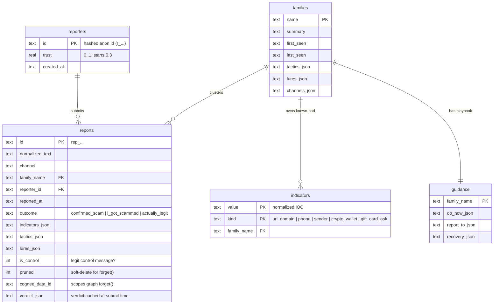
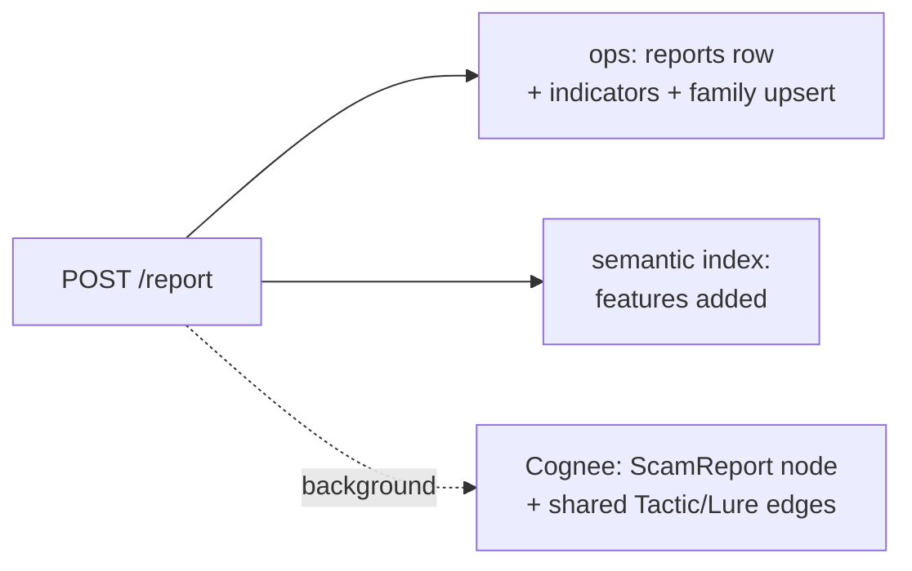

# Data model

Antibody keeps state in three places, each chosen for what it does best:

1. **Ops SQLite** — operational rows, the deterministic signals, and the feed.
2. **Cognee graph** — the de-identified, traversable scam knowledge.
3. **In-memory semantic index** — a fast, always-available meaning-similarity layer.

## 1. Ops SQLite (`api/memory/store.py`)

Plain synchronous `sqlite3`, single connection guarded by one `RLock` — sized for the
single-user hackathon scale it targets. Lives under `DATA_DIR/antibody_ops.db`.

Notes:

- **`reporters.trust`** starts at `0.3`, rises `+0.1` on a confirmed hit, falls `-0.05`
  on `actually_legit`, clamped to `[0, 1]`. It weights corroboration so sockpuppet
  floods can't manufacture confidence.
- **`reports.is_control`** marks a *legit* message. Controls feed the semantic index so
  the asymmetric gate can recognize legit look-alikes (see
  [confidence engine](confidence-engine.md#legit-controls-the-other-half-of-the-gate)).
- **`reports.pruned`** is a soft delete — a forgotten report leaves an audit trail but
  stops poisoning matches.
- **`reports.cognee_data_id`** ties an ops row to its Cognee document so a `forget()`
  scopes to exactly that graph node. Added via a lightweight migration (`ALTER TABLE`)
  for DBs created before the column existed.
- **`indicators`** is the CONFIRMED fast path: an exact `(value, kind)` lookup is the
  cheapest, strongest single signal.
- **`reports.verdict_json`** caches the full verdict produced at submit time, so
  `GET /report/{id}` (shareable links, My Reports) replays it instantly with zero
  LLM cost.

## 2. Cognee graph ontology (`api/memory/ontology.py`)

The `graph_model` passed to `cognify()`. Rooted at `ScamReport`; `Tactic` and `Lure`
are **shared nodes** de-duplicated by label across all families (the traversal that
earns the graph its value — see [memory layer](memory-layer.md#the-shared-node-ontology)).

| Node | Key fields | Indexed for embedding |
|---|---|---|
| `ScamReport` | `normalized_text`, `channel`, `family`, `tactics[]`, `lures[]`, `indicators[]`, `outcome` | `normalized_text` |
| `ScamFamily` | `name`, `summary`, `first_seen`, `last_seen`, `tactics[]`, `lures[]` | `name`, `summary` |
| `Tactic` *(shared)* | `label`, `category` | `label` |
| `Lure` *(shared)* | `label` | `label` |
| `Channel` | `label` | `label` |
| `Indicator` | `kind`, `value` | `value` |

The graph is **de-identified**: no reporter identity ever enters it. Reporter data
stays in the ops `reporters` table.

## 3. In-memory semantic index (`api/memory/semantic.py`)

A dependency-free character/word n-gram cosine index, rebuilt from active (non-pruned)
ops reports at startup and after any prune/promotion. It serves two roles:

- a fast **local pre-filter** for meaning-similarity, and
- a **guaranteed-available fallback** so the semantic signal never goes dark if
  Cognee's vector store is unavailable.

Each item is `(report_id, family, is_control, features)`. Raw cosine is rescaled from
the band `[0.35, 0.85]` onto `[0, 1]` strength. `best_family()` compares the best scam
match against the best legit-control match and returns `looks_legit=True` when a
control wins — the data-driven half of the asymmetric gate.

## Where a single report lives

One submitted report leaves a trace in all three:

The ops row and semantic entry are written on the **fast path** (synchronously, before
the response). The Cognee node is written on the **slow path** (background), and its
`data_id` is written back onto the ops row when it lands.
