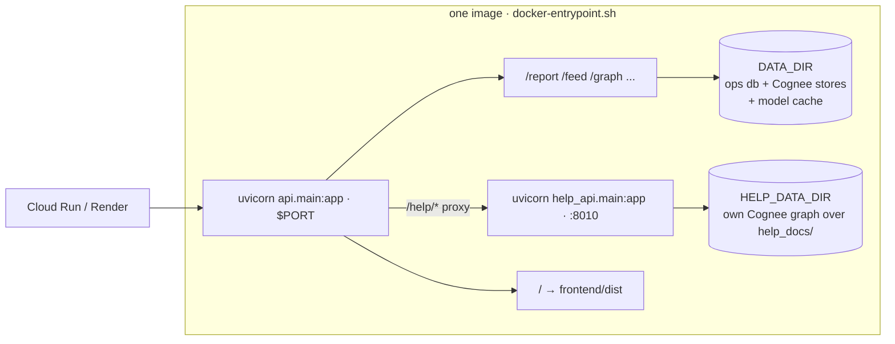

# Deployment

Antibody ships as a **single Docker container** that runs **two processes**
(`docker-entrypoint.sh`): the main app (`api.main:app`, which serves the JSON API
*and* the built frontend) and the Help chatbot (`help_api.main:app` on an internal
port). The main app reverse-proxies `/help/*` to the help process, so from outside
it's still one origin, one service, no production CORS setup. The two are separate
processes on purpose — Cognee's config is a process-wide singleton, so the docs
graph and the scam graph each need their own process (see `help_api/config.py`).



## Local

```bash
docker build -t antibody .
docker run -p 8000:8000 --env-file .env antibody
# open http://localhost:8000
```

The image is a two-stage build: stage 1 builds the frontend with Node, stage 2 is a
slim Python runtime that installs `api/requirements.txt`, bakes the fastembed model
into the image (so the first cold-boot report doesn't block downloading it), installs
the Tesseract binary for OCR, and copies in `api/`, `seed/`, `help_api/`,
`help_docs/`, and the built frontend. On boot the help process re-ingests
`help_docs/*.md` into its own Cognee graph (content-deduped, so it's a no-op
unless the disk was wiped — which is exactly what Cloud Run cold starts do).

## Google Cloud Run (what the live demo runs on)

```bash
gcloud run deploy antibody --source . --region <region> \
  --memory 2Gi --cpu 1 --max-instances 3 --allow-unauthenticated \
  --execution-environment gen2 --no-cpu-throttling --quiet
```

**Two flags matter more than they look:**

- **`--execution-environment gen2`** — the default gen1 sandbox (gVisor) breaks
  Python's async HTTP clients (aiohttp *and* httpx fail with a generic "Connection
  error") on outbound LLM API calls, even though raw `curl` from the same project
  works. gen2 runs a real Linux kernel and fixes it.
- **`--no-cpu-throttling`** — Antibody runs `cognify()` as a background task *after*
  responding. Without this flag, Cloud Run throttles CPU to ~zero once the response
  is sent, starving the graph-enrichment step.

**Secrets:** put the LLM key in Secret Manager and reference it —
`--set-secrets "LLM_API_KEY=<secret-name>:latest"` — never in `--set-env-vars`, which
would persist it in revision metadata. The Help chatbot reads its own prefixed vars, so
reference the same secret twice:
`--set-secrets "LLM_API_KEY=<secret>:latest,HELP_LLM_API_KEY=<secret>:latest"`.
Without a key, Antibody still runs correctly on its deterministic + semantic fallback
path (and the Help tab degrades to a friendly "not configured" answer).

**Memory:** use at least `--memory 2Gi` — the container runs two Cognee processes
(scam graph + help-docs graph), each with its own embedded Kuzu/LanceDB stores.

**Ephemeral disk:** Cloud Run's disk is ephemeral, but the seed graph auto-loads on any
empty boot (`load_seed_if_empty()`), so a cold start just reloads the demo data — the
feed is never empty.

## Render (git-connected alternative)

The same Dockerfile works as a Render Docker web service (free tier). Point it at the
repo, set `DATA_DIR` to a writable path, and add any `LLM_*` secrets in the dashboard.

## Environment variables

All optional — without an LLM key the deterministic + semantic layer still produces
correct verdicts.

| Variable | Default | Notes |
|---|---|---|
| `APP_ENV` | `dev` | `dev` surfaces full error messages; anything else hides 500 internals |
| `API_HOST` / `API_PORT` | `127.0.0.1` / `8000` | Cloud Run injects `PORT`; the Dockerfile binds it |
| `WEB_ORIGIN` | `http://localhost:5173` | added to the CORS allowlist |
| `DATA_DIR` | `./.antibody_data` | ops DB + Cognee's embedded kuzu/lancedb stores + model cache |
| `DATASET_NAME` | `antibody_global` | the one shared graph (herd immunity) |
| `LLM_PROVIDER` / `LLM_MODEL` / `LLM_ENDPOINT` / `LLM_API_KEY` | — | OpenAI-compatible, read by Cognee |
| `EMBEDDING_PROVIDER` / `EMBEDDING_MODEL` / `EMBEDDING_DIMENSIONS` | `fastembed` / `all-MiniLM-L6-v2` / `384` | local, no key |
| `EMBEDDING_ENDPOINT` / `EMBEDDING_API_KEY` | — | only for a remote embedding provider |
| `BAND_CONFIRMED` / `BAND_LIKELY` / `BAND_SUSPICIOUS` | `0.85` / `0.60` / `0.35` | verdict thresholds |
| `HELP_LLM_PROVIDER` / `HELP_LLM_MODEL` / `HELP_LLM_ENDPOINT` / `HELP_LLM_API_KEY` | — | same convention, for the Help chatbot's own process |
| `HELP_DATA_DIR` | `./.antibody_help_data` | the help-docs graph, isolated from `DATA_DIR` |
| `HELP_API_URL` | `http://127.0.0.1:8010` | where the main app proxies `/help/*` |

### LLM provider examples

Both `LLM_*` and `EMBEDDING_*` follow Cognee's "custom OpenAI-compatible endpoint"
convention (litellm-style model strings):

```bash
# OpenAI
LLM_PROVIDER=openai
LLM_MODEL=gpt-4o-mini

# NVIDIA NIM (chat) — keep embeddings on local fastembed
LLM_PROVIDER=custom
LLM_MODEL=nvidia_nim/meta/llama-4-maverick-17b-128e-instruct
LLM_ENDPOINT=https://integrate.api.nvidia.com/v1
LLM_API_KEY=nvapi-...
EMBEDDING_PROVIDER=fastembed
```

> **Keep embeddings on fastembed even when using NIM for chat.** NIM's `nv-embedqa-e5-v5`
> is an *asymmetric* model that requires an `input_type` param on every call; Cognee's
> litellm adapter doesn't send one, so every embed request 400s and retries with
> exponential backoff — it silently stalls requests rather than erroring. fastembed runs
> locally, needs no key, and is what CI/tests use.

## Smoke test after deploy

```bash
curl -s https://<host>/health                       # {"status":"ok", ...}
curl -s https://<host>/help/health                  # help chatbot process is up
curl -s https://<host>/feed | head -c 200            # feed is populated (seed auto-loaded)
curl -s https://<host>/report -H 'Content-Type: application/json' \
     -d '{"text":"pay a redelivery fee at usps-fee.biz"}'   # returns a verdict
```

The first request after an idle period may take ~15s while the instance cold-starts and
warms the (baked-in) embedding model.
