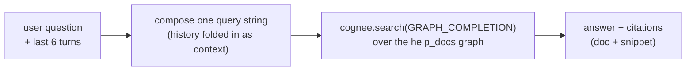

# The Help chatbot

The **Help tab** in the web app is a small RAG chatbot that answers questions about
Antibody itself — what a verdict band means, why the leaderboard looks empty, how to
remove a false-positive report, what the browser extension actually sends. It is a
second, independent Cognee-backed service, not a feature bolted onto the main app.

## Why it's a separate process

Cognee's config (embeddings, providers, vector/graph DB paths) is a **process-wide
singleton** — one process can only run one Cognee configuration at a time. The main
API already has its own Cognee graph (de-identified scam knowledge); the Help chatbot
needs a second, unrelated graph (Markdown docs about the product). Importing both into
one process would make the second `cognee.config` call silently clobber the first.

So `help_api/` is its own FastAPI app, its own `config.py`, and its own Cognee dataset —
running as a **second OS process**, never mounted into `api/main.py`.

```text
help_api/
  config.py         # own LLM / embedding / data-dir settings, isolated from api/
  ingest.py         # loads help_docs/*.md into a dedicated Cognee graph
  memory_service.py # HelpMemoryService — add / cognify / ask over the docs graph
  main.py           # POST /help/ask, GET /help/health
help_docs/          # the markdown source the chatbot is trained on (this file's sibling)
```

## How a question is answered



- `POST /help/ask` takes `{ question, history }`. `GRAPH_COMPLETION` has no native
  multi-turn message list, so prior turns are folded into one query string ahead of the
  actual question (`help_api/main.py::_compose_query`, last 6 turns).
- The response includes **citations** — each one names the source doc and a snippet —
  which the frontend renders under the assistant's bubble (`HelpView.jsx`).
- If the docs graph isn't ingested yet or no LLM key is configured, `/help/ask` returns
  `available: false` with a message telling you how to fix it, instead of a 500.

## Reaching it in production

Locally the two processes run on different ports and Vite's dev proxy bridges them. In
a deployed single-container setup there's no dev proxy, so `api/main.py` exposes a
catch-all reverse proxy at `/help/{path}` that forwards to the Help process over
loopback (`HELP_API_URL`, default `http://127.0.0.1:8010`) using `httpx.AsyncClient`.
This is what `docker-entrypoint.sh` sets up: it backgrounds
`uvicorn help_api.main:app --port 8010` and execs the main API as PID 1. See
[deployment](deployment.md) for the container/Cloud Run details.

## Running it locally

```bash
# One-off: build the help knowledge graph from help_docs/*.md
python -m help_api.ingest ./help_docs

# Start the Help API
uvicorn help_api.main:app --host 127.0.0.1 --port 8010
```

The Vite dev server proxies `/help` → `:8010` automatically, so the Help tab just
works once both processes are running. No LLM key means `/help/ask` degrades to the
`available: false` response above — the rest of the app is unaffected.

## Self-healing on Cloud Run's ephemeral disk

Cloud Run instances can restart with a wiped local filesystem. `help_api/main.py`'s
lifespan re-runs `add()` + `cognify()` over `help_docs/` on every boot as a background
task (never blocking `/help/health`); Cognee dedupes by content, so on a warm instance
this is a no-op, and after a cold restart it rebuilds the graph automatically. The
first `/help/ask` right after a cold start can return a generic answer for ~1-2 minutes
while ingestion finishes — this is expected, not a bug.

## Isolation guarantee

The Help chatbot's graph and the scam-report graph never share a dataset, a config, or
a process. A change to one (new docs, a reingest, an LLM swap) cannot affect the other,
and neither can appear in the other's search results.
