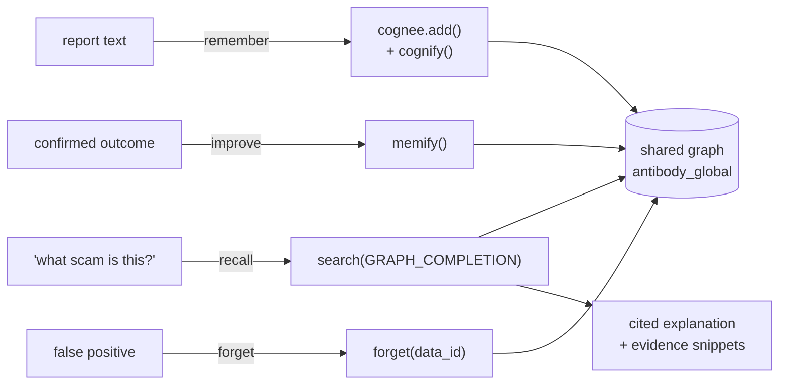
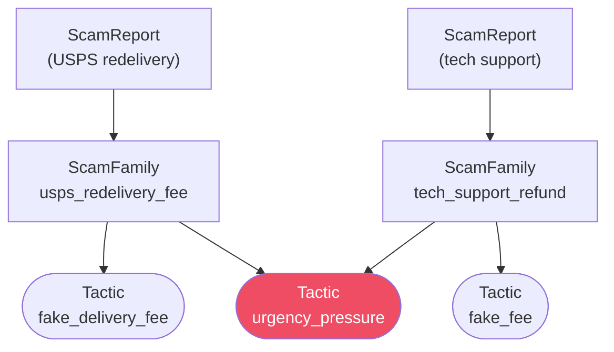

# The memory layer (Cognee)

Antibody's memory runs on [Cognee](https://github.com/topoteretes/cognee), a
self-hosted, open-source memory layer. Cognee is the **system of record** for scam
knowledge: reports are ingested into a shared knowledge graph where the campaigns
that matter — and the tactics they share — become traversable structure, not just
rows.

Everything Cognee-related lives behind **one module**,
[`api/memory/memory_service.py`](../api/memory/memory_service.py). It is the entire
blast radius of a Cognee version bump, and every method degrades gracefully.

## The four verbs

Antibody maps the whole product onto four Cognee operations:

| Verb | Cognee call | When |
|---|---|---|
| **remember** | `add()` + `cognify(graph_model=ScamOntology)` | On every report (background, after the verdict is returned) |
| **recall** | `search(GRAPH_COMPLETION, include_references=True)` | To produce a **cited** explanation (only when an LLM key is set) |
| **improve** | `memify()` / `improve()` | After a confirmed outcome — reinforce recurring tactics, decay stale families |
| **forget** | `forget(data_id=..., dataset=...)` | To prune a false positive or poisoned report out of the graph |



## The shared-node ontology

The design decision that makes this a *graph* and not a vector pile lives in
[`api/memory/ontology.py`](../api/memory/ontology.py):

> **`Tactic` and `Lure` are shared nodes across families.** The same label string
> (`"fake_delivery_fee"`) resolves to the *same node* in every report and family
> that uses it.



Because `urgency_pressure` is one shared node, a single graph traversal answers
*"which other families use this tactic?"* — the query behind Antibody's shared-tactic
graph beat. Duplicating `Tactic`/`Lure` per report would destroy this.

The full `graph_model` (root is `ScamReport`):

```
ScamReport ──has── Channel
           ──in──── ScamFamily ──uses──> Tactic  (shared)
           ──uses─> Tactic (shared)      ──lures─> Lure   (shared)
           ──lures> Lure   (shared)
           ──has──> Indicator (hard IOC, the fast-path key)
```

## Graceful degradation is a contract

Antibody must run correctly for a judge with **no API keys**. So every memory call
follows the same rule:

```python
try:
    ...  # cognee call
except MemoryUnavailable:
    ...  # fall back to the deterministic + semantic layer
```

- **No `cognee` installed / no LLM key** → `MemoryUnavailable` is raised on first use.
- **Callers never crash** — the verdict engine falls back to deterministic indicator
  matching + the local fastembed/cosine semantic layer, which produce a correct band
  on their own.
- The demo is therefore **never dark**: `GET /health` reports `llm: false`, and reports
  still get verdicts, feeds still populate, families still form.

An LLM key adds three things on top: Cognee's **cited** graph explanations
(`GRAPH_COMPLETION`), richer `cognify`-extracted tactics/lures, and the
`improve`/`forget` feedback loop.

## Config and isolation

- **One shared dataset**, `antibody_global` — herd immunity is the whole point, so
  every report contributes to one graph rather than per-user silos.
- Cognee runs **zero-config self-hosted**: embedded SQLite + LanceDB + Kuzu under
  `DATA_DIR`, no Postgres/Neo4j required. See `config.py`'s `export_cognee_env()` for
  how Antibody's settings are mirrored onto the env vars Cognee reads.
- **Embeddings stay local** (`fastembed`, `all-MiniLM-L6-v2`, 384-dim) by default —
  no key, and it's what CI/tests use. See the README's environment table for why NIM's
  asymmetric embedding model is deliberately *not* used for embeddings.

## Scoped, reversible forget

`forget()` always scopes a deletion to a specific `data_id` **paired with the shared
dataset**, so a prune can never accidentally touch another document. The real Cognee
`data_id` for each report is captured at ingest time and stored on the ops report row
(`cognee_data_id`), so a later false-positive prune deletes exactly the right graph
document. Reporter PII is never in the graph to begin with, so a privacy erasure is a
SQLite delete — see [Security & privacy](security-and-privacy.md).
