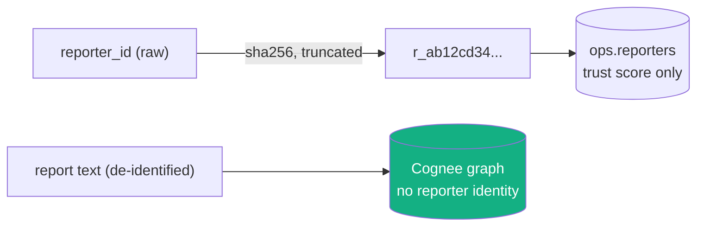

# Security & privacy

Antibody handles reports about fraud, from people who may already be victims. Three
properties are treated as load-bearing, not features: **it never accuses the innocent**,
**it never stores who reported what**, and **it resists being poisoned**.

## 1. The asymmetric safety gate (never hard-accuse the innocent)

The single most important property in the system: a message can only be marked
`confirmed` on a **hard** signal (an exact known-bad indicator or a strong structural
match). Semantic resemblance alone can never reach `confirmed`.

This is a design decision about which failure is worse. A false "Confirmed scam" on a
legitimate bank fraud-alert — which by construction *reads like* a scam — is worse than
a cautious "Suspicious" on a real scam. So the gate is asymmetric: when unsure, Antibody
**cautions and educates** rather than accuses. It has a dedicated regression test
([`test_confidence.py::test_decide_semantic_only_never_reaches_confirmed`](../tests/unit/test_confidence.py))
that must never break. Full mechanics: [confidence engine](confidence-engine.md#the-asymmetric-safety-gate).

## 2. Privacy by construction (de-identified graph)

**Reporter identity never enters the Cognee graph.** The durable scam knowledge —
families, tactics, lures — is de-identified. Anything that could identify a *reporter*
lives only in the ops SQLite `reporters` table.

- **Reporter ids are hashed on the way in.** `anon_reporter()` takes any client handle
  and returns `"r_" + sha256(handle)[:16]`. The raw handle is never stored; the graph
  never sees even the hash.
- **A privacy erasure is a normal DB delete.** Because PII lives only in a SQLite table
  and never in the graph, honoring "forget me" is a `DELETE`, not risky graph surgery.
- **`forget()` is scoped and reversible-safe.** A false-positive prune scopes a Cognee
  `forget(data_id=..., dataset="antibody_global")` to exactly one document via the
  `cognee_data_id` recorded at ingest, so a prune can never touch another report.

## 3. Anti-poisoning (resist bad-faith reports)

A shared, community-fed graph is a poisoning target: flood it with fake reports and you
could manufacture a false "Confirmed," or bury a real scam. Antibody's defenses:

- **Trust-weighted, distinct-reporter corroboration.** Corroboration counts *distinct*
  reporters weighted by their trust, not raw submission volume — so N sockpuppets from
  one source don't add up to N independent confirmations. It also saturates below 1.0
  (`1 − e^{-k·w}`), so no amount of volume reaches certainty by corroboration alone.
- **A corroboration floor on the confirmed gate.** Without a hard indicator, a
  structural-only match needs several trust-weighted reporters before it can reach
  `confirmed` — one low-trust account can't push a verdict over the line.
- **Trust that's earned.** New reporters start at `0.3`. Trust rises only on *confirmed*
  outcomes and falls on `actually_legit`, so the leaderboard rewards accuracy, not spam.
- **The family-inheritance guard.** A report can't borrow another family's corroboration
  unless it has its own primary signal tying it there (see
  [confidence engine](confidence-engine.md#the-family-inheritance-guard)).
- **`forget()` prunes poison back out.** A confirmed false positive is soft-deleted from
  the ops store (stops poisoning semantic matches) and scoped-deleted from the graph.

## 4. Input & indicator safety

- **Legit hosts are never flagged.** Indicator extraction carries an allowlist of common
  legitimate hosts (`usps.com`, `paypal.com`, `chase.com`, …) so a real link to a real
  company is never treated as a known-bad IOC.
- **Indicators are normalized before comparison.** Domains are lowercased and stripped of
  `www.`, phones are pushed toward E.164, wallets are matched by shape — so the same IOC
  can't slip past by casing or formatting.
- **Multimodal intake degrades, never crashes.** A corrupt screenshot, an unreadable PDF,
  or a missing OCR binary yields `""` and a graceful "couldn't read the file" verdict,
  never a 500 (covered by [`test_loaders.py`](../tests/unit/test_loaders.py)).

## 5. Operational hygiene

- **Uniform error envelope, no internal leakage.** Every error returns
  `{error, message, request_id, path}`. Unexpected 500s hide their message outside
  `APP_ENV=dev`; the full stack trace goes to the server log, tagged with the same
  `request_id` the client received.
- **Secrets stay out of revision metadata.** Deployment guidance puts the LLM key in
  Secret Manager, never in `--set-env-vars` (see [deployment](deployment.md)).
- **CORS is an explicit allowlist**, not a wildcard, and credentials are scoped to it.

## Threat model boundaries (honest scope)

Antibody is a single-user / community demo, not a hardened multi-tenant SaaS. It does
**not** currently implement auth, per-tenant isolation, or rate limiting — those are
out of scope for the shared-graph demo. The properties above are the ones that matter
for *this* product: not accusing the innocent, not storing who reported what, and not
being trivially poisoned.
